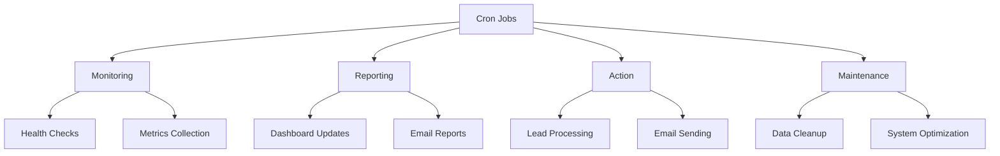

# Chapter 21: Cron Architecture at Scale

*Orchestrating 50+ production cron jobs with dependencies, error handling, and cost tracking*

---

## The Cron Orchestration Engine

Running one or two cron jobs is easy. Running 50+ with dependencies, retry logic, cost optimization, and monitoring? That's a system.

Most cron implementations fail at scale: jobs conflict, costs spiral, failures cascade, and monitoring is nonexistent. This chapter fixes that. We'll build a production-grade cron orchestration system that handles 50+ jobs, manages dependencies, implements circuit breakers, tracks costs, and provides a dashboard for monitoring.

By the end, you'll have a complete cron architecture with 50 ready-to-use templates across 10 categories, plus the systems to manage them.

## Cron Taxonomy: Four Job Types



**1. Monitoring Jobs** - Watch systems, check health, collect metrics
**2. Reporting Jobs** - Generate summaries, update dashboards, send emails  
**3. Action Jobs** - Perform business operations (lead processing, outreach)
**4. Maintenance Jobs** - Clean up, optimize, backup, archival

Each type has different failure tolerance, scheduling needs, and monitoring requirements.

## 50 Production-Ready Cron Templates

**Format for each template:**
- **Name**: Descriptive job name
- **Category**: Morning/Evening, Market Monitoring, Content & Social Media, Client Management, System Maintenance, Lead Generation, Email Campaigns, Financial Tracking, Data Collection, Custom Workflows
- **Cron Expression**: Standard cron syntax
- **Model Tier**: Mini, Standard, Premium
- **Estimated Cost/Run**: USD based on model usage
- **Complete Prompt**: Exact prompt to give the AI

---

### Category 1: Morning/Evening Routines

**Template 1.1: Morning Business Dashboard**

```json
{
  "name": "morning_business_dashboard",
  "category": "Morning/Evening Routines",
  "cron": "0 9 * * 1-5",
  "model_tier": "Standard",
  "estimated_cost_per_run": 0.25,
  "prompt": "Generate morning business dashboard report:\n\n1. **Pipeline Status**\n   - New leads added yesterday\n   - Leads contacted yesterday (email/LinkedIn)\n   - Leads who replied yesterday\n   - Meetings scheduled today\n\n2. **Revenue Metrics**\n   - New revenue yesterday (from Stripe webhooks)\n   - MRR (Monthly Recurring Revenue) current\n   - Revenue vs. goal for month\n\n3. **System Health**\n   - Cron jobs that failed yesterday\n   - Email sending limits remaining\n   - API usage across services\n\n4. **Market Indicators**\n   - Stock market pre-market movers\n   - Crypto top gainers/losers\n   - Key economic calendar events today\n\n5. **Action Items**\n   - High-priority leads to contact today\n   - Meetings to prepare for\n   - System issues to investigate\n\nQuery Supabase for all data. Format as clear markdown with metrics, trends, and action items. Send summary via email using Resend if enabled."
}
```

**Template 1.2: Evening Performance Review**

```json
{
  "name": "evening_performance_review",
  "category": "Morning/Evening Routines",
  "cron": "0 18 * * 1-5",
  "model_tier": "Standard",
  "estimated_cost_per_run": 0.30,
  "prompt": "Generate evening performance review:\n\n1. **Daily Accomplishments**\n   - Emails sent/replied\n   - Leads contacted/converted\n   - Revenue generated\n   - Tasks completed\n\n2. **Pipeline Analysis**\n   - Lead status changes today\n   - Conversion funnel metrics\n   - Bottlenecks identified\n\n3. **System Performance**\n   - Cron job success/failure rates\n   - Email deliverability stats\n   - API usage and costs\n\n4. **Tomorrow's Priorities**\n   - High-value leads to follow up\n   - Scheduled meetings\n   - System maintenance needed\n\n5. **Weekly Trend Analysis** (if Friday)\n   - Week-over-week comparisons\n   - Monthly progress vs goals\n   - Key learnings for next week\n\nQuery Supabase for today's data. Include comparisons to yesterday and weekly averages. Format for quick review. Save to memory file for long-term tracking."
}
```

**Template 1.3: Weekend Planning**

```json
{
  "name": "weekend_planning",
  "category": "Morning/Evening Routines",
  "cron": "0 10 * * 6",
  "model_tier": "Premium",
  "estimated_cost_per_run": 0.50,
  "prompt": "Generate weekend planning and strategic review:\n\n1. **Weekly Business Review**\n   - Revenue vs. target\n   - Lead pipeline health\n   - Conversion rate analysis\n   - Cost vs. budget\n\n2. **System Audit**\n   - All cron job performance\n   - Database growth and optimization\n   - API cost analysis\n   - Error patterns and fixes\n\n3. **Competitive/Market Analysis**\n   - Industry news and trends\n   - Competitor moves\n   - Market opportunities identified\n\n4. **Strategic Planning**\n   - Next week's priorities\n   - Long-term roadmap alignment\n   - Resource allocation\n   - Risk assessment\n\n5. **Personal Development**\n   - Skills to learn/improve\n   - Network expansion targets\n   - Health/wellness check\n\nCreate comprehensive report with data from Supabase, external APIs, and web searches. Focus on insights, not just data. Save as weekend-review-YYYY-MM-DD.md."
}
```

**Template 1.4: Daily Health Check**

```json
{
  "name": "daily_health_check",
  "category": "Morning/Evening Routines",
  "cron": "0 8,12,16,20 * * *",
  "model_tier": "Mini",
  "estimated_cost_per_run": 0.05,
  "prompt": "Execute quick system health check:\n\n1. **API Status**\n   - Supabase connection\n   - OpenAI API availability\n   - Resend email service\n   - Stripe API\n\n2. **Cron Status**\n   - Last 6 hours of cron executions\n   - Any failures or delays\n   - Queue lengths\n\n3. **Resource Monitoring**\n   - Database disk usage\n   - API rate limit usage\n   - Email sending limits\n\n4. **Alert if Needed**\n   - If any service down, send alert\n   - If approaching limits, notify\n   - If errors detected, log details\n\nReturn simple status: ✅ All systems normal, ⚠️ Warning, or ❌ Issues detected. No detailed report unless problems found."
}
```

**Template 1.5: End-of-Day Cleanup**

```json
{
  "name": "end_of_day_cleanup",
  "category": "Morning/Evening Routines",
  "cron": "0 23 * * *",
  "model_tier": "Mini",
  "estimated_cost_per_run": 0.08,
  "prompt": "Perform end-of-day cleanup:\n\n1. **Temporary Data**\n   - Delete temp files older than 24h\n   - Clear browser cache if needed\n   - Clean up download folders\n\n2. **Database Maintenance**\n   - Update statistics on lead tables\n   - Vacuum if needed (analyze only)\n   - Check for orphaned records\n\n3. **Log Rotation**\n   - Compress logs older than 7 days\n   - Delete logs older than 30 days\n   - Archive important logs\n\n4. **Backup Verification**\n   - Check latest backup exists\n   - Verify backup size reasonable\n   - Log backup status\n\n5. **Resource Cleanup**\n   - Kill any zombie processes\n   - Close unused connections\n   - Free up memory\n\nLog all actions. Report any issues. Keep it lightweight."
}
```

### Category 2: Market Monitoring

**Template 2.1: Stock Market Scanner**

```json
{
  "name": "stock_market_scanner",
  "category": "Market Monitoring",
  "cron": "*/15 9-16 * * 1-5",
  "model_tier": "Standard",
  "estimated_cost_per_run": 0.15,
  "prompt": "Scan stock market for opportunities:\n\n1. **Pre-Market Movers** (before 9:30 AM)\n   - Stocks up/down >5% pre-market\n   - Volume spikes\n   - News catalysts\n\n2. **Intraday Scanning**\n   - Unusual volume (3x average)\n   - Breakouts (new 52-week highs/lows)\n   - Gap fills in progress\n   - Key support/resistance tests\n\n3. **Sector Analysis**\n   - Strongest/weakest sectors\n   - Sector rotation patterns\n   - ETF flow analysis\n\n4. **Economic Data**\n   - Fed announcements\n   - Economic reports released\n   - Earnings surprises\n\n5. **Paper Trading Signals**\n   - RSI extremes (<30 or >70)\n   - MACD crossovers\n   - Moving average breakouts\n\nUse free APIs (Alpha Vantage, Yahoo Finance). Store signals in Supabase trades table. Alert on high-confidence signals only. DISCLAIMER: Paper trading only."
}
```

**Template 2.2: Crypto Market Monitor**

```json
{
  "name": "crypto_market_monitor",
  "category": "Market Monitoring",
  "cron": "*/30 * * * *",
  "model_tier": "Standard",
  "estimated_cost_per_run": 0.12,
  "prompt": "Monitor cryptocurrency markets:\n\n1. **Top Movers**\n   - 24h gainers/losers (>10%)\n   - Volume spikes (5x average)\n   - Market cap changes\n\n2. **Bitcoin Dominance**\n   - BTC dominance trend\n   - Altcoin season indicators\n   - Market sentiment\n\n3. **DeFi Metrics**\n   - Total Value Locked (TVL)\n   - Top DeFi protocols\n   - Yield farming opportunities\n\n4. **On-Chain Data**\n   - Exchange flows\n   - Whale movements\n   - Miner activity\n\n5. **Regulatory News**\n   - SEC/CFTC announcements\n   - Country regulations\n   - Exchange developments\n\nUse CoinGecko/CoinMarketCap APIs. Store in Supabase crypto_metrics table. Generate alerts for extreme movements. Focus on patterns, not price predictions."
}
```

**Template 2.3: Economic Calendar Watcher**

```json
{
  "name": "economic_calendar_watcher",
  "category": "Market Monitoring",
  "cron": "0 7 * * 1-5",
  "model_tier": "Mini",
  "estimated_cost_per_run": 0.07,
  "prompt": "Check economic calendar for today:\n\n1. **High-Impact Events**\n   - Fed interest rate decisions\n   - CPI/PPI inflation data\n   - Jobs reports (NFP)\n   - GDP releases\n\n2. **Medium-Impact Events**\n   - Retail sales\n   - Manufacturing PMI\n   - Housing data\n   - Consumer confidence\n\n3. **Earnings Calendar**\n   - Major companies reporting\n   - Expected moves\n   - Previous surprises\n\n4. **Central Bank Speakers**\n   - Fed chair speeches\n   - ECB/BOE/BOJ announcements\n\n5. **Market Holidays**\n   - Exchange closures\n   - Early closes\n\nScrape investing.com/economic-calendar or use free API. Store events in Supabase. Alert for high-impact events within next 24h."
}
```

**Template 2.4: News Sentiment Analyzer**

```json
{
  "name": "news_sentiment_analyzer",
  "category": "Market Monitoring",
  "cron": "*/20 * * * *",
  "model_tier": "Premium",
  "estimated_cost_per_run": 0.35,
  "prompt": "Analyze financial news sentiment:\n\n1. **News Aggregation**\n   - Top financial headlines\n   - Sector-specific news\n   - Company-specific mentions\n\n2. **Sentiment Analysis**\n   - Positive/negative/neutral classification\n   - Sentiment trends over time\n   - Unusual sentiment spikes\n\n3. **Topic Extraction**\n   - Key topics discussed\n   - Emerging narratives\n   - Risk factors mentioned\n\n4. **Market Impact Correlation**\n   - News vs. price movements\n   - Lag/lead relationships\n   - False signals identification\n\n5. **Alert Generation**\n   - Extreme sentiment readings\n   - Breaking news on watched tickers\n   - Narrative shifts\n\nUse NewsAPI, Alpha Vantage News, or web scraping. Analyze with GPT-4 for nuanced sentiment. Store analysis in Supabase news_sentiment table."
}
```

**Template 2.5: Portfolio Performance Tracker**

```json
{
  "name": "portfolio_performance_tracker",
  "category": "Market Monitoring",
  "cron": "0 16 * * 1-5",
  "model_tier": "Standard",
  "estimated_cost_per_run": 0.20,
  "prompt": "Track portfolio performance:\n\n1. **Daily Performance**\n   - Portfolio value change\n   - Individual position P&L\n   - Win/loss ratio\n   - Average gain/loss\n\n2. **Risk Metrics**\n   - Portfolio volatility\n   - Max drawdown\n   - Sharpe ratio (if enough data)\n   - Correlation matrix\n\n3. **Benchmark Comparison**\n   - vs. S&P 500\n   - vs. Nasdaq\n   - vs. sector ETFs\n\n4. **Position Analysis**\n   - Top contributors to P&L\n   - Worst performing positions\n   - Concentration risk\n\n5. **Trade Journal Update**\n   - Log today's trades\n   - Record lessons learned\n   - Update trading rules\n\nPull data from Alpaca paper trading account. Calculate metrics. Store in Supabase portfolio_history. Generate insights, not just numbers."
}
```

### Category 3: Content & Social Media

**Template 3.1: AI Blog Post Generator**

```json
{
  "name": "ai_blog_post_generator",
  "category": "Content & Social Media",
  "cron": "0 10 * * 2,4",
  "model_tier": "Premium",
  "estimated_cost_per_run": 0.75,
  "prompt": "Generate SEO-optimized blog post:\n\n1. **Topic Research**\n   - Analyze top-ranking articles for target keyword\n   - Identify content gaps\n   - Determine optimal structure\n\n2. **Content Creation**\n   - Write 1500-2000 word article\n   - Include H2/H3 headers\n   - Add data points and examples\n   - Incorporate target keyword naturally\n\n3. **SEO Optimization**\n   - Meta description\n   - URL slug\n   - Image alt text suggestions\n   - Internal/external linking strategy\n\n4. **Promotion Plan**\n   - Social media snippets\n   - Email newsletter excerpt\n   - LinkedIn post version\n\n5. **Publishing**\n   - Format for Astro/Next.js\n   - Generate featured image concept\n   - Schedule publishing date\n\nUse keyword from content calendar in Supabase. Research competing articles. Create unique, valuable content. Save as markdown file in /content/blog/. Update content calendar."
}
```

**Template 3.2: Social Media Scheduler**

```json
{
  "name": "social_media_scheduler",
  "category": "Content & Social Media",
  "cron": "0 9,13,17 * * *",
  "model_tier": "Standard",
  "estimated_cost_per_run": 0.25,
  "prompt": "Create and schedule social media posts:\n\n1. **Content Selection**\n   - Recent blog posts\n   - Industry news commentary\n   - Case study highlights\n   - Quick tips/insights\n\n2. **Platform Optimization**\n   - Twitter: Short, punchy, hashtags\n   - LinkedIn: Professional, detailed\n   - Instagram: Visual, story-focused\n   - Facebook: Community-oriented\n\n3. **Scheduling**\n   - Optimal posting times\n   - Content calendar alignment\n   - Campaign coordination\n\n4. **Engagement Check**\n   - Respond to comments\n   - Like/follow relevant accounts\n   - Join conversations\n\n5. **Performance Tracking**\n   - Engagement metrics\n   - Follower growth\n   - Top performing content\n\nUse Buffer/Hootsuite API or direct platform APIs. Store posts in Supabase social_posts table. Maintain brand voice consistency."
}
```

**Template 3.3: Newsletter Content Curator**

```json
{
  "name": "newsletter_content_curator",
  "category": "Content & Social Media",
  "cron": "0 14 * * 4",
  "model_tier": "Standard",
  "estimated_cost_per_run": 0.30,
  "prompt": "Curate weekly newsletter content:\n\n1. **Content Collection**\n   - Top blog posts from week\n   - Industry news summaries\n   - Tool/resource discoveries\n   - Case study highlights\n\n2. **Newsletter Structure**\n   - Engaging subject line\n   - Personal introduction\n   - 3-5 main sections\n   - Clear CTAs\n   - Personal sign-off\n\n3. **Design & Formatting**\n   - Mobile-responsive HTML\n   - Brand colors/fonts\n   - Image optimization\n   - Plain text fallback\n\n4. **Subscriber Management**\n   - Segment by engagement\n   - Personalization tokens\n   - Unsubscribe handling\n\n5. **Performance Metrics**\n   - Previous issue stats\n   - A/B test results\n   - List growth\n\nPull from Supabase content tables. Use Resend for sending. Schedule for Friday morning delivery. Track opens/clicks."
}
```

**Template 3.4: SEO Performance Tracker**

```json
{
  "name": "seo_performance_tracker",
  "category": "Content & Social Media",
  "cron": "0 8 * * 1",
  "model_tier": "Premium",
  "estimated_cost_per_run": 0.40,
  "prompt": "Track SEO performance:\n\n1. **Ranking Check**\n   - Target keyword positions\n   - Featured snippet opportunities\n   - SERP feature appearances\n\n2. **Traffic Analysis**\n   - Organic traffic trends\n   - Top landing pages\n   - Bounce rate improvements\n\n3. **Technical SEO**\n   - Page speed scores\n   - Mobile responsiveness\n   - Indexation status\n   - Broken links\n\n4. **Competitor Analysis**\n   - Competitor ranking changes\n   - Content gap analysis\n   - Backlink monitoring\n\n5. **Action Plan**\n   - Quick wins identified\n   - Content optimization needed\n   - Technical fixes required\n\nUse Google Search Console API, SEMrush/Ahrefs if available. Store trends in Supabase seo_metrics. Generate actionable insights."
}
```

**Template 3.5: Content Repurposing Engine**

```json
{
  "name": "content_repurposing_engine",
  "category": "Content & Social Media",
  "cron": "0 11 * * 3",
  "model_tier": "Standard",
  "estimated_cost_per_run": 0.20,
  "prompt": "Repurpose existing content:\n\n1. **Content Audit**\n   - High-performing blog posts\n   - Evergreen content identification\n   - Content with update potential\n\n2. **Repurposing Formats**\n   - Blog post → Twitter thread\n   - Case study → LinkedIn article\n   - Guide → YouTube script\n   - Data → Infographic\n\n3. **Platform Optimization**\n   - Format for each platform\n   - Add platform-specific CTAs\n   - Update statistics/facts\n\n4. **Scheduling**\n   - Content calendar integration\n   - Optimal timing per platform\n   - Campaign alignment\n\n5. **Performance Recycling**\n   - Update old posts with new data\n   - Combine related posts into guides\n   - Create content clusters\n\nPull from Supabase content table. Focus on maximizing ROI from existing content. Update publication dates where appropriate."
}
```

### Category 4: Client Management

**Template 4.1: Client Check-In Scheduler**

```json
{
  "name": "client_check_in_scheduler",
  "category": "Client Management",
  "cron": "0 10 * * 2",
  "model_tier": "Standard",
  "estimated_cost_per_run": 0.18,
  "prompt": "Schedule client check-ins:\n\n1. **Client Review**\n   - Active clients list\n   - Last contact date\n   - Project milestones\n   - Support tickets open\n\n2. **Check-In Prioritization**\n   - Clients overdue for contact\n   - High-value clients\n   - At-risk clients (low engagement)\n   - Renewal dates approaching\n\n3. **Personalized Messages**\n   - Reference recent work\n   - Ask specific questions\n   - Share relevant updates\n   - Clear call to action\n\n4. **Scheduling**\n   - Calendar link generation\n   - Timezone consideration\n   - Buffer between meetings\n\n5. **Follow-Up System**\n   - Email templates ready\n   - Reminder scheduling\n   - No-response escalation\n\nQuery Supabase clients table. Use personalized templates. Schedule via Calendly/Zapier. Log all communications."
}
```

**Template 4.2: Onboarding Progress Tracker**

```json
{
  "name": "onboarding_progress_tracker",
  "category": "Client Management",
  "cron": "0 9 * * *",
  "model_tier": "Mini",
  "estimated_cost_per_run": 0.10,
  "prompt": "Track client onboarding progress:\n\n1. **New Clients**\n   - Clients signed in last 24h\n   - Onboarding steps completed\n   - Pending actions\n\n2. **Progress Monitoring**\n   - Average time per step\n   - Bottlenecks identified\n   - Satisfaction check-ins\n\n3. **Automated Follow-Ups**\n   - Next step reminders\n   - Resource delivery\n   - FAQ based on progress\n\n4. **Success Metrics**\n   - Time to first value\n   - Onboarding completion rate\n   - Early satisfaction scores\n\n5. **Intervention Flags**\n   - Stalled onboardings\n   - Low engagement signals\n   - Support requests needed\n\nPull from Supabase onboarding_steps. Send automated emails via Resend. Update client status. Alert for interventions."
}
```

**Template 4.3: Support Ticket Triage**

```json
{
  "name": "support_ticket_triage",
  "category": "Client Management",
  "cron": "*/30 * * * *",
  "model_tier": "Standard",
  "estimated_cost_per_run": 0.15,
  "prompt": "Triage support tickets:\n\n1. **New Tickets**\n   - Tickets created since last check\n   - Urgency assessment\n   - Category classification\n\n2. **Prioritization**\n   - Critical (system down)\n   - High (blocking work)\n   - Medium (feature request)\n   - Low (question/clarification)\n\n3. **Auto-Responses**\n   - Acknowledgement emails\n   - Estimated response time\n   - Relevant documentation\n\n4. **Escalation Rules**\n   - Urgent tickets to primary contact\n   - Technical issues to developer\n   - Billing issues to finance\n\n5. **Trend Analysis**\n   - Common issue patterns\n   - Knowledge gap identification\n   - Process improvement ideas\n\nUse Help Scout/Zendesk API or Supabase tickets table. Apply business rules. Send appropriate responses. Update ticket status."
}
```

**Template 4.4: Client Success Metrics**

```json
{
  "name": "client_success_metrics",
  "category": "Client Management",
  "cron": "0 8 * * 1",
  "model_tier": "Premium",
  "estimated_cost_per_run": 0.35,
  "prompt": "Analyze client success metrics:\n\n1. **Engagement Metrics**\n   - Product usage frequency\n   - Feature adoption rates\n   - Support ticket volume/trend\n\n2. **Success Indicators**\n   - Goal achievement tracking\n   - ROI calculations\n   - Time to value\n\n3. **Risk Assessment**\n   - At-risk client identification\n   - Churn prediction signals\n   - Satisfaction score trends\n\n4. **Expansion Opportunities**\n   - Usage patterns suggesting upgrade\n   - Feature requests indicating need\n   - Referral likelihood\n\n5. **Strategic Insights**\n   - Client segmentation analysis\n   - Success pattern identification\n   - Service improvement areas\n\nQuery Supabase usage_data and clients tables. Calculate NPS/CSAT if available. Generate insights for account management."
}
```

**Template 4.5: Renewal Forecasting**

```json
{
  "name": "renewal_forecasting",
  "category": "Client Management",
  "cron": "0 9 * * 15",
  "model_tier": "Premium",
  "estimated_cost_per_run": 0.40,
  "prompt": "Forecast client renewals:\n\n1. **Upcoming Renewals**\n   - Contracts ending next 30/60/90 days\n   - Auto-renewal vs. manual\n   - Price changes scheduled\n\n2. **Renewal Likelihood**\n   - Usage/engagement scores\n   - Support ticket history\n   - Payment history\n   - Relationship health\n\n3. **Risk Assessment**\n   - High-risk renewals\n   - Medium-risk (needs attention)\n   - Low-risk (likely renewal)\n\n4. **Action Plan**\n   - At-risk client outreach strategy\n   - Success story sharing\n   - Incentive planning\n\n5. **Revenue Projection**\n   - Expected renewal revenue\n   - Upsell potential\n   - Churn risk impact\n\nCalculate using Supabase contract_data and usage metrics. Generate prioritized outreach list. Update sales forecast."
}
```

### Category 5: System Maintenance

**Template 5.1: Database Optimization**

```json
{
  "name": "database_optimization",
  "category": "System Maintenance",
  "cron": "0 2 * * 0",
  "model_tier": "Mini",
  "estimated_cost_per_run": 0.05,
  "prompt": "Perform database maintenance:\n\n1. **Performance Analysis**\n   - Slow query identification\n   - Index usage statistics\n   - Table size growth\n\n2. **Optimization Tasks**\n   - Create missing indexes\n   - Update table statistics\n   - Vacuum analyze tables\n   - Archival of old data\n\n3. **Backup Verification**\n   - Latest backup existence\n   - Backup size validation\n   - Restoration test planning\n\n4. **Security Audit**\n   - Unused user accounts\n   - Excessive permissions\n   - RLS policy gaps\n\n5. **Capacity Planning**\n   - Growth rate projection\n   - Storage needs forecast\n   - Performance bottleneck prediction\n\nUse Supabase dashboard API or direct PostgreSQL queries. Perform only safe optimizations. Log all actions. Alert on issues."
}
```

**Template 5.2: API Cost Monitor**

```json
{
  "name": "api_cost_monitor",
  "category": "System Maintenance",
  "cron": "0 0 * * *",
  "model_tier": "Standard",
  "estimated_cost_per_run": 0.15,
  "prompt": "Monitor API costs:\n\n1. **OpenAI API Usage**\n   - Daily/monthly usage\n   - Cost per endpoint\n   - Token optimization opportunities\n\n2. **Other API Costs**\n   - Resend email costs\n   - Stripe transaction fees\n   - Supabase usage costs\n   - Third-party API expenses\n\n3. **Cost Trends**\n   - Week-over-week changes\n   - Month-to-date vs. budget\n   - Cost per customer/lead\n\n4. **Optimization Suggestions**\n   - Model tier adjustments\n   - Batch processing opportunities\n   - Cache implementation ideas\n\n5. **Alert Thresholds**\n   - Monthly budget warnings\n   - Unusual usage spikes\n   - Cost efficiency degradation\n\nPull from OpenAI dashboard, Resend, Stripe, Supabase. Calculate ROI metrics. Generate cost-saving recommendations."
}
```

**Template 5.3: Security Audit**

```json
{
  "name": "security_audit",
  "category": "System Maintenance",
  "cron": "0 3 * * 0",
  "model_tier": "Premium",
  "estimated_cost_per_run": 0.45,
  "prompt": "Conduct weekly security audit:\n\n1. **Access Review**\n   - User account activity\n   - API key rotation status\n   - Permission creep detection\n\n2. **Vulnerability Scan**\n   - Dependency vulnerabilities\n   - Environment variable exposure\n   - Configuration weaknesses\n\n3. **Compliance Check**\n   - GDPR requirements\n   - Data retention policies\n   - Privacy policy updates\n\n4. **Backup Integrity**\n   - Backup encryption status\n   - Offsite backup verification\n   - Recovery procedure testing\n\n5. **Incident Review**\n   - Security events past week\n   - False positive analysis\n   - Rule tuning recommendations\n\nCheck npm audit, GitHub dependabot, Supabase logs. Review .env files. Update security documentation. Alert on critical issues."
}
```

**Template 5.4: Log Analysis & Cleanup**

```json
{
  "name": "log_analysis_cleanup",
  "category": "System Maintenance",
  "cron": "0 4 * * *",
  "model_tier": "Mini",
  "estimated_cost_per_run": 0.08,
  "prompt": "Analyze and clean up logs:\n\n1. **Error Log Analysis**\n   - Frequent error patterns\n   - New errors introduced\n   - Error severity classification\n\n2. **Performance Logs**\n   - Slow endpoint identification\n   - Resource usage trends\n   - Response time degradation\n\n3. **Log Rotation**\n   - Compress old logs\n   - Delete beyond retention\n   - Archive critical logs\n\n4. **Anomaly Detection**\n   - Unusual traffic patterns\n   - Security event indicators\n   - System health anomalies\n\n5. **Reporting**\n   - Daily error summary\n   - Performance metrics\n   - Action items\n\nProcess Supabase logs, application logs, API logs. Use regex patterns. Store summaries in database. Clean up disk space."
}
```

**Template 5.5: Dependency Update Manager**

```json
{
  "name": "dependency_update_manager",
  "category": "System Maintenance",
  "cron": "0 5 * * 1",
  "model_tier": "Standard",
  "estimated_cost_per_run": 0.20,
  "prompt": "Manage dependency updates:\n\n1. **Update Check**\n   - npm package updates\n   - Docker image updates\n   - System package updates\n\n2. **Security Assessment**\n   - Critical vulnerabilities\n   - Breaking change analysis\n   - Compatibility testing needed\n\n3. **Update Planning**\n   - Safe update schedule\n   - Staging environment testing\n   - Rollback procedures\n\n4. **Automated Updates**\n   - Non-breaking minor updates\n   - Security patches\n   - Documentation updates\n\n5. **Change Log**\n   - Update history tracking\n   - Performance impact assessment\n   - Issue correlation analysis\n\nRun npm outdated, docker outdated, system updates. Create PRs for updates. Test in staging. Deploy safe updates. Log all changes."
}
```

### Category 6: Lead Generation

**Template 6.1: Lead Pipeline Processor**

```json
{
  "name": "lead_pipeline_processor",
  "category": "Lead Generation",
  "cron": "0 */2 * * *",
  "model_tier": "Standard",
  "estimated_cost_per_run": 0.25,
  "prompt": "Process lead pipeline:\n\n1. **New Lead Ingestion**\n   - Check for new leads from forms\n   - Validate contact information\n   - De-duplication check\n\n2. **Lead Enrichment**\n   - Company data enrichment\n   - Contact verification\n   - Social profile linking\n\n3. **Scoring & Prioritization**\n   - Apply scoring model\n   - Update lead status\n   - Assign to appropriate campaign\n\n4. **Campaign Assignment**\n   - Email sequence enrollment\n   - LinkedIn outreach scheduling\n   - Follow-up task creation\n\n5. **Pipeline Health**\n   - Bottleneck identification\n   - Conversion rate monitoring\n   - Source effectiveness\n\nUse LeadScraper, LeadEnricher, LeadScorer from Chapter 19. Process up to 50 leads per run. Update Supabase tables. Report metrics."
}
```

**Template 6.2: LinkedIn Connection Manager**

```json
{
  "name": "linkedin_connection_manager",
  "category": "Lead Generation",
  "cron": "0 10,14,16 * * 1-5",
  "model_tier": "Premium",
  "estimated_cost_per_run": 0.35,
  "prompt": "Manage LinkedIn outreach:\n\n1. **Connection Requests**\n   - Find target profiles\n   - Personalized connection messages\n   - Respect LinkedIn limits\n\n2. **Message Follow-ups**\n   - Check for accepted connections\n   - Send value-first messages\n   - Schedule conversations\n\n3. **Content Engagement**\n   - Like/comment on target posts\n   - Share relevant content\n   - Build relationship\n\n4. **Profile Optimization**\n   - Update headline/bio\n   - Add relevant skills\n   - Post thought leadership\n\n5. **Analytics & Optimization**\n   - Connection acceptance rate\n   - Response rate tracking\n   - Profile view analysis\n\nUse LinkedIn API (with caution) or manual via browser automation. Store interactions in Supabase. Focus on quality, not quantity."
}
```

**Template 6.3: Lead Re-engagement Campaign**

```json
{
  "name": "lead_reengagement_campaign",
  "category": "Lead Generation",
  "cron": "0 9 * * 15",
  "model_tier": "Standard",
  "estimated_cost_per_run": 0.22,
  "prompt": "Re-engage cold leads:\n\n1. **Lead Selection**\n   - Leads inactive >60 days\n   - Previously interested but didn't convert\n   - High-fit leads gone cold\n\n2. **Re-engagement Strategy**\n   - New angle/offer\n   - Success story sharing\n   - Industry update relevance\n\n3. **Multi-Channel Approach**\n   - Personalized email\n   - LinkedIn connection/message\n   - Twitter follow/engagement\n\n4. **Response Handling**\n   - Quick reply to responses\n   - Updated lead scoring\n   - Campaign adjustment\n\n5. **Effectiveness Measurement**\n   - Re-engagement rate\n   - Cost per re-engagement\n   - Conversion from re-engaged\n\nQuery Supabase for cold leads. Create tailored messages. Use multiple touchpoints. Track re-engagement success."
}
```

**Template 6.4: Competitor Lead Analysis**

```json
{
  "name": "competitor_lead_analysis",
  "category": "Lead Generation",
  "cron": "0 8 * * 1",
  "model_tier": "Premium",
  "estimated_cost_per_run": 0.40,
  "prompt": "Analyze competitor leads:\n\n1. **Competitor Identification**\n   - Direct competitors\n   - Alternative solutions\n   - Market position analysis\n\n2. **Lead Overlap Analysis**\n   - Companies using competitors\n   - Switching triggers\n   - Pain points with competitors\n\n3. **Win/Loss Analysis**\n   - Why we win vs. competitor\n   - Why we lose vs. competitor\n   - Competitive advantages\n\n4. **Targeting Strategy**\n   - Competitor weaknesses to exploit\n   - Market gaps to fill\n   - Messaging adjustments\n\n5. **Monitoring Setup**\n   - Competitor news alerts\n   - Pricing change monitoring\n   - Feature release tracking\n\nResearch competitor websites, reviews, case studies. Analyze win/loss data. Update ICP and messaging. Create competitive battle cards."
}
```

**Template 6.5: Referral Program Manager**

```json
{
  "name": "referral_program_manager",
  "category": "Lead Generation",
  "cron": "0 11 * * 1",
  "model_tier": "Standard",
  "estimated_cost_per_run": 0.25,
  "prompt": "Manage referral program:\n\n1. **Referral Identification**\n   - New leads from referrals\n   - Referral source tracking\n   - Quality assessment\n\n2. **Incentive Management**\n   - Reward calculation\n   - Payment processing\n   - Thank you messages\n\n3. **Program Promotion**\n   - Client outreach for referrals\n   - Social media promotion\n   - Email campaign\n\n4. **Performance Analysis**\n   - Referral conversion rate\n   - Cost per referral vs. other channels\n   - Referral quality metrics\n\n5. **Optimization**\n   - Incentive structure testing\n   - Promotion channel effectiveness\n   - Program rule adjustments\n\nTrack referral links in Supabase. Calculate rewards. Process payments via Stripe. Analyze ROI of referral program."
}
```

### Category 7: Email Campaigns

**Template 7.1: Email Sequence Manager**

```json
{
  "name": "email_sequence_manager",
  "category": "Email Campaigns",
  "cron": "*/15 * * * *",
  "model_tier": "Standard",
  "estimated_cost_per_run": 0.18,
  "prompt": "Manage email sequences:\n\n1. **Scheduled Email Check**\n   - Emails ready to send\n   - Rate limit compliance\n   - Timezone optimization\n\n2. **Send Execution**\n   - Personalization application\n   - SPAM score check\n   - Deliverability optimization\n\n3. **Reply Detection**\n   - Inbox monitoring\n   - Auto-response handling\n   - Lead status updates\n\n4. **Performance Tracking**\n   - Open/click rates  
   - Reply rate monitoring
   - Unsubscribe/bounce handling\n\n5. **Sequence Optimization**\n   - A/B test result application\n   - Timing optimization\n   - Content improvement\n\nUse EmailScheduler from Chapter 20. Send emails via Resend. Track metrics. Pause sequences for replies. Update lead status."
}
```

**Template 7.2: List Hygiene Manager**

```json
{
  "name": "list_hygiene_manager",
  "category": "Email Campaigns",
  "cron": "0 3 * * 0",
  "model_tier": "Mini",
  "estimated_cost_per_run": 0.08,
  "prompt": "Maintain email list hygiene:\n\n1. **Bounce Handling**\n   - Hard bounces removal\n   - Soft bounce monitoring\n   - Email validation\n\n2. **Engagement Cleaning**\n   - Inactive subscribers (no opens >90 days)\n   - Never opened removal\n   - Re-engagement attempt\n\n3. **Compliance Check**\n   - Unsubscribe requests processed\n   - GDPR compliance verification\n   - CAN-SPAM requirements\n\n4. **Segment Optimization**\n   - List segmentation review\n   - Tag cleanup\n   - Merge purge\n\n5. **List Growth Tracking**\n   - Net subscriber growth\n   - Quality metrics\n   - Source effectiveness\n\nQuery Supabase email_events table. Remove invalid emails. Create re-engagement campaign for inactives. Update list segments."
}
```

**Template 7.3: A/B Test Analyzer**

```json
{
  "name": "ab_test_analyzer",
  "category": "Email Campaigns",
  "cron": "0 7 * * *",
  "model_tier": "Premium",
  "estimated_cost_per_run": 0.30,
  "prompt": "Analyze email A/B tests:\n\n1. **Test Results Collection**\n   - Open rate comparison\n   - Click rate comparison\n   - Reply rate comparison\n   - Conversion rate comparison\n\n2. **Statistical Significance**\n   - Confidence level calculation\n   - Minimum sample size check\n   - False positive risk assessment\n\n3. **Winner Declaration**\n   - Statistically significant winners\n   - Practical significance consideration\n   - Test duration assessment\n\n4. **Implementation Planning**\n   - Winner rollout strategy\n   - Loser analysis insights\n   - New test hypotheses\n\n5. **Test Library Management**\n   - Archive completed tests\n   - Document learnings\n   - Update best practices\n\nCalculate using Supabase ab_test_results. Use statistical methods. Declare winners only with confidence >95%. Update email templates."
}
```

**Template 7.4: Deliverability Monitor**

```json
{
  "name": "deliverability_monitor",
  "category": "Email Campaigns",
  "cron": "0 */6 * * *",
  "model_tier": "Standard",
  "estimated_cost_per_run": 0.20,
  "prompt": "Monitor email deliverability:\n\n1. **Sender Reputation**\n   - SPF/DKIM/DMARC status\n   - Blacklist monitoring\n   - Domain authentication\n\n2. **Engagement Metrics**\n   - Open rate trends\n   - Click rate trends\n   - Spam complaint rate\n   - Unsubscribe rate\n\n3. **Infrastructure Health**\n   - IP reputation check\n   - Bounce rate analysis\n   - List hygiene status\n\n4. **Issue Detection**\n   - Deliverability drops\n   - Blocked emails\n   - Filtering issues\n\n5. **Remediation Actions**\n   - Warmup schedule adjustment\n   - Content optimization\n   - Sending pattern changes\n\nCheck email service provider dashboards. Monitor bounce/complaint rates. Adjust sending practices. Maintain >98% deliverability."
}
```

**Template 7.5: Campaign Performance Reporter**

```json
{
  "name": "campaign_performance_reporter",
  "category": "Email Campaigns",
  "cron": "0 8 * * 1",
  "model_tier": "Premium",
  "estimated_cost_per_run": 0.35,
  "prompt": "Report email campaign performance:\n\n1. **Weekly Performance**\n   - Campaigns sent\n   - Total emails delivered\n   - Aggregate open/click rates\n   - Reply/conversion rates\n\n2. **Campaign Deep Dives**\n   - Top performing campaigns\n   - Underperforming campaigns\n   - A/B test results\n\n3. **Segment Analysis**\n   - Performance by audience segment\n   - Personalization effectiveness\n   - Timing optimization insights\n\n4. **ROI Calculation**\n   - Revenue attributed to campaigns\n   - Cost per lead/acquired customer\n   - Campaign efficiency scoring\n\n5. **Strategic Recommendations**\n   - Campaign adjustments needed\n   - New campaign ideas\n   - Budget reallocation suggestions\n\nAnalyze Supabase email_events and revenue data. Calculate attribution. Generate insights for strategy optimization."
}
```

### Category 8: Financial Tracking

**Template 8.1: Daily Revenue Tracker**

```json
{
  "name": "daily_revenue_tracker",
  "category": "Financial Tracking",
  "cron": "0 23 * * *",
  "model_tier": "Mini",
  "estimated_cost_per_run": 0.10,
  "prompt": "Track daily revenue:\n\n1. **Revenue Collection**\n   - Stripe transactions today\n   - PayPal transactions\n   - Other payment sources\n\n2. **Metrics Calculation**\n   - Daily Recurring Revenue (DRR)\n   - Monthly Recurring Revenue (MRR)\n   - Annual Recurring Revenue (ARR)\n\n3. **Trend Analysis**\n   - Day-over-day growth\n   - Week-over-week comparison\n   - Month-to-date progress\n\n4. **Customer Metrics**\n   - New customers today\n   - Churned customers\n   - Net customer growth\n\n5. **Revenue Attribution**\n   - Source of revenue (product/service)\n   - Campaign attribution\n   - Customer segment revenue\n\nPull from Stripe API, PayPal API. Calculate key SaaS metrics. Store in Supabase revenue table. Update dashboard."
}
```

**Template 8.2: Expense Monitor**

```json
{
  "name": "expense_monitor",
  "category": "Financial Tracking",
  "cron": "0 0 * * *",
  "model_tier": "Standard",
  "estimated_cost_per_run": 0.15,
  "prompt": "Monitor business expenses:\n\n1. **API Costs**\n   - OpenAI usage costs\n   - AWS/cloud services\n   - Third-party API expenses\n\n2. **Software Subscriptions**\n   - SaaS tool renewals\n   - License fees\n   - Service subscriptions\n\n3. **Operational Expenses**\n   - Domain/hosting costs\n   - Payment processing fees\n   - Professional services\n\n4. **Budget Tracking**\n   - Actual vs. budget\n   - Category spending trends\n   - Cost optimization opportunities\n\n5. **Cash Flow Analysis**\n   - Burn rate calculation\n   - Runway projection\n   - Financial health indicators\n\nCollect from various provider dashboards. Categorize expenses. Calculate burn rate. Alert on budget overruns."
}
```

**Template 8.3: Profitability Analyzer**

```json
{
  "name": "profitability_analyzer",
  "category": "Financial Tracking",
  "cron": "0 2 * * 1",
  "model_tier": "Premium",
  "estimated_cost_per_run": 0.40,
  "prompt": "Analyze business profitability:\n\n1. **Revenue Analysis**\n   - Revenue by product/service\n   - Revenue by customer segment\n   - Revenue growth drivers\n\n2. **Cost Analysis**\n   - Cost of goods sold (COGS)\n   - Customer acquisition cost (CAC)\n   - Operational expenses\n\n3. **Profit Margin Calculation**\n   - Gross profit margin\n   - Net profit margin\n   - Contribution margin by product\n\n4. **Unit Economics**\n   - Lifetime Value (LTV)\n   - LTV:CAC ratio\n   - Payback period\n\n5. **Strategic Insights**\n   - Most profitable products\n   - Most profitable customer segments\n   - Optimization opportunities\n\nCalculate using Supabase revenue and expense data. Analyze unit economics. Identify profitability drivers. Recommend optimizations."
}
```

**Template 8.4: Tax Preparation Assistant**

```json
{
  "name": "tax_preparation_assistant",
  "category": "Financial Tracking",
  "cron": "0 4 15 * *",
  "model_tier": "Premium",
  "estimated_cost_per_run": 0.50,
  "prompt": "Prepare tax documentation:\n\n1. **Income Documentation**\n   - Monthly revenue summaries\n   - Customer invoices\n   - Payment records\n\n2. **Expense Documentation**\n   - Categorized expenses\n   - Receipt collection\n   - Business deductions\n\n3. **Tax Calculation**\n   - Estimated quarterly taxes\n   - Sales tax collection\n   - International tax considerations\n\n4. **Document Organization**\n   - PDF generation for records\n   - Spreadsheet preparation\n   - Accountant-ready packages\n\n5. **Compliance Check**\n   - Filing deadlines\n   - Required forms identification\n   - Documentation completeness\n\nNOT tax advice. Collect financial data from Supabase. Organize for tax professional. Generate summary reports. Track deadlines."
}
```

**Template 8.5: Financial Forecasting**

```json
{
  "name": "financial_forecasting",
  "category": "Financial Tracking",
  "cron": "0 6 1 * *",
  "model_tier": "Premium",
  "estimated_cost_per_run": 0.60,
  "prompt": "Generate financial forecasts:\n\n1. **Historical Analysis**\n   - Revenue growth trends\n   - Expense patterns\n   - Seasonality identification\n\n2. **Forecast Models**\n   - Next month revenue projection\n   - Quarterly forecast\n   - Annual budget projection\n\n3. **Scenario Planning**\n   - Best case scenario\n   - Worst case scenario  
   - Most likely scenario\n\n4. **Resource Planning**\n   - Hiring timeline based on revenue\n   - Marketing budget allocation\n   - Product development investment\n\n5. **Risk Assessment**\n   - Cash flow risks\n   - Market risks\n   - Operational risks\n\nUse time series analysis on Supabase data. Create multiple scenarios. Update financial model. Inform strategic decisions."
}
```

### Category 9: Data Collection

**Template 9.1: Web Data Collector**

```json
{
  "name": "web_data_collector",
  "category": "Data Collection",
  "cron": "0 */4 * * *",
  "model_tier": "Standard",
  "estimated_cost_per_run": 0.22,
  "prompt": "Collect web data:\n\n1. **Competitor Monitoring**\n   - Price changes\n   - Feature updates\n   - Content publications\n\n2. **Market Research**\n   - Industry news aggregation\n   - Trend identification\n   - Opportunity spotting\n\n3. **Lead Source Monitoring**\n   - New company listings\n   - Job postings (hiring signals)\n   - Funding announcements\n\n4. **Social Listening**\n   - Brand mentions\n   - Industry conversations\n   - Customer sentiment\n\n5. **Data Processing**\n   - Clean and structure data\n   - Store in Supabase\n   - Alert on significant findings\n\nUse web scraping (respect robots.txt). APIs where available. Store structured data. Identify actionable insights."
}
```

**Template 9.2: API Data Syncer**

```json
{
  "name": "api_data_syncer",
  "category": "Data Collection",
  "cron": "*/30 * * * *",
  "model_tier": "Mini",
  "estimated_cost_per_run": 0.12,
  "prompt": "Sync API data:\n\n1. **Stripe Data Sync**\n   - New customers\n   - Updated subscriptions\n   - Payment events\n\n2. **Resend Data Sync**\n   - Email events\n   - Campaign metrics\n   - List changes\n\n3. **Supabase Data Sync**\n   - Cross-database synchronization\n   - Backup verification\n   - Data consistency checks\n\n4. **Third-party API Sync**\n   - Market data APIs\n   - Weather/geographic data\n   - External business data\n\n5. **Error Handling**\n   - API failure recovery\n   - Rate limit handling\n   - Data validation\n\nUse official APIs with proper authentication. Handle pagination. Update Supabase tables. Log sync status."
}
```

**Template 9.3: Data Quality Validator**

```json
{
  "name": "data_quality_validator",
  "category": "Data Collection",
  "cron": "0 1 * * *",
  "model_tier": "Standard",
  "estimated_cost_per_run": 0.18,
  "prompt": "Validate data quality:\n\n1. **Completeness Check**\n   - Missing required fields\n   - Null value analysis\n   - Data coverage assessment\n\n2. **Accuracy Validation**\n   - Email format validation\n   - Phone number formatting\n   - Address verification\n\n3. **Consistency Analysis**\n   - Duplicate detection\n   - Contradictory data identification\n   - Standard format compliance\n\n4. **Timeliness Assessment**\n   - Stale data identification\n   - Update frequency monitoring\n   - Real-time data latency\n\n5. **Cleaning & Enrichment**\n   - Auto-correction where possible  
   - Manual review flags
   - Enrichment prioritization\n\nRun validation rules on Supabase tables. Identify data issues. Create cleaning tasks. Maintain data quality score."
}
```

**Template 9.4: Data Backup Manager**

```json
{
  "name": "data_backup_manager",
  "category": "Data Collection",
  "cron": "0 3 * * *",
  "model_tier": "Mini",
  "estimated_cost_per_run": 0.08,
  "prompt": "Manage data backups:\n\n1. **Database Backup**\n   - Supabase backup verification\n   - Export critical tables\n   - Backup integrity check\n\n2. **File Backup**\n   - Code repository backup\n   - Document storage backup\n   - Configuration file backup\n\n3. **Backup Rotation**\n   - Daily/weekly/monthly rotation\n   - Offsite backup verification\n   - Retention policy enforcement\n\n4. **Recovery Testing**\n   - Sample restoration test\n   - Recovery time estimation\n   - Recovery procedure documentation\n\n5. **Backup Health Monitoring**\n   - Success/failure tracking\n   - Storage usage monitoring\n   - Cost optimization\n\nUse Supabase backup API, GitHub backups, cloud storage. Verify backup completeness. Test recovery procedures regularly."
}
```

**Template 9.5: Data Analytics Processor**

```json
{
  "name": "data_analytics_processor",
  "category": "Data Collection",
  "cron": "0 4 * * *",
  "model_tier": "Premium",
  "estimated_cost_per_run": 0.35,
  "prompt": "Process data analytics:\n\n1. **Aggregation**\n   - Daily/weekly/monthly aggregates\n   - Customer segment summaries\n   - Product performance metrics\n\n2. **Trend Analysis**\n   - Time series decomposition\n   - Seasonality detection\n   - Trend forecasting\n\n3. **Correlation Analysis**\n   - Feature relationships\n   - Lead conversion drivers\n   - Revenue predictors\n\n4. **Segmentation**\n   - Customer clustering\n   - Behavior pattern identification\n   - Personalized targeting groups\n\n5. **Insight Generation**\n   - Actionable insights extraction\n   - Dashboard data preparation\n   - Alert condition evaluation\n\nProcess Supabase data using SQL and statistical methods. Generate pre-computed aggregates. Update analytics tables. Power dashboards."
}
```

### Category 10: Custom Workflows

**Template 10.1: Custom Integration Builder**

```json
{
  "name": "custom_integration_builder",
  "category": "Custom Workflows",
  "cron": "0 9 * * *",
  "model_tier": "Premium",
  "estimated_cost_per_run": 0.45,
  "prompt": "Build custom integrations:\n\n1. **Integration Identification**\n   - Manual process analysis\n   - Automation opportunity scoring\n   - ROI calculation\n\n2. **Integration Design**\n   - API research\n   - Data mapping design\n   - Error handling strategy\n\n3. **Implementation**\n   - Code generation\n   - Testing suite creation\n   - Documentation writing\n\n4. **Deployment**\n   - Staging testing\n   - Production deployment\n   - Monitoring setup\n\n5. **Maintenance Planning**\n   - Update schedule\n   - Breaking change monitoring\n   - Usage tracking\n\nAnalyze business processes. Design API integrations. Write production code. Deploy and monitor. Document thoroughly."
}
```

**Template 10.2: Workflow Automator**

```json
{
  "name": "workflow_automator",
  "category": "Custom Workflows",
  "cron": "*/10 * * * *",
  "model_tier": "Standard",
  "estimated_cost_per_run": 0.20,
  "prompt": "Automate business workflows:\n\n1. **Workflow Detection**\n   - Repetitive task identification\n   - Process bottleneck analysis\n   - Automation priority scoring\n\n2. **Automation Design**\n   - Step-by-step automation plan\n   - Exception handling design\n   - Human intervention points\n\n3. **Implementation**\n   - Script/code creation\n   - Integration with existing systems\n   - User notification setup\n\n4. **Execution**\n   - Run automated workflows\n   - Handle exceptions\n   - Log results\n\n5. **Optimization**\n   - Performance monitoring\n   - Success rate tracking\n   - Continuous improvement\n\nMonitor for repetitive patterns. Automate with scripts. Handle edge cases. Report on time savings."
}
```

**Template 10.3: Alert System Manager**

```json
{
  "name": "alert_system_manager",
  "category": "Custom Workflows",
  "cron": "*/5 * * * *",
  "model_tier": "Mini",
  "estimated_cost_per_run": 0.10,
  "prompt": "Manage alert system:\n\n1. **Alert Condition Monitoring**\n   - Business metric thresholds\n   - System health indicators\n   - Security event detection\n\n2. **Alert Prioritization**\n   - Critical vs. informational\n   - Time sensitivity assessment\n   - Recipient determination\n\n3. **Notification Delivery**\n   - Email alerts\n   - SMS notifications\n   - Dashboard alerts\n\n4. **Alert Response Tracking**\n   - Acknowledgement monitoring\n   - Resolution time tracking\n   - Escalation handling\n\n5. **Alert Tuning**\n   - False positive reduction\n   - Threshold optimization\n   - Recipient list management\n\nCheck alert conditions in Supabase. Send appropriate notifications. Track responses. Reduce alert fatigue."
}
```

**Template 10.4: Business Rule Engine**

```json
{
  "name": "business_rule_engine",
  "category": "Custom Workflows",
  "cron": "*/15 * * * *",
  "model_tier": "Standard",
  "estimated_cost_per_run": 0.25,
  "prompt": "Execute business rules:\n\n1. **Rule Evaluation**\n   - Lead qualification rules\n   - Pricing rules\n   - Workflow routing rules\n\n2. **Action Execution**\n   - Automated decisions\n   - Notification triggering\n   - Data updates\n\n3. **Rule Performance Tracking**\n   - Rule effectiveness metrics\n   - Exception rate monitoring\n   - Outcome analysis\n\n4. **Rule Optimization**\n   - Rule tuning based on outcomes\n   - New rule creation\n   - Deprecated rule removal\n\n5. **Compliance Verification**\n   - Rule compliance checking\n   - Audit trail generation\n   - Regulation alignment\n\nEvaluate rules defined in Supabase business_rules table. Execute actions. Track outcomes. Optimize rule performance."
}
```

**Template 10.5: System Orchestrator**

```json
{
  "name": "system_orchestrator",
  "category": "Custom Workflows",
  "cron": "*/30 * * * *",
  "model_tier": "Premium",
  "estimated_cost_per_run": 0.30,
  "prompt": "Orchestrate system workflows:\n\n1. **Workflow Coordination**\n   - Job dependency management\n   - Execution order optimization\n   - Resource allocation\n\n2. **State Management**\n   - Workflow state tracking\n   - Rollback capability\n   - Recovery point identification\n\n3. **Performance Optimization**\n   - Parallel execution where possible\n   - Bottleneck identification\n   - Resource utilization optimization\n\n4. **Monitoring & Reporting**\n   - Workflow success rates\n   - Execution time tracking\n   - Cost efficiency analysis\n\n5. **Self-Healing**\n   - Automatic retry on failure\n   - Alternative path selection\n   - Human escalation when stuck\n\nManage complex multi-step workflows. Handle dependencies. Optimize execution. Provide comprehensive monitoring."
}
```

## Job Dependencies and Sequencing

### Dependency Management System

```sql
-- Job dependencies schema
CREATE TABLE cron_jobs (
  id uuid DEFAULT gen_random_uuid() PRIMARY KEY,
  name text NOT NULL UNIQUE,
  cron_expression text NOT NULL,
  model_tier text NOT NULL CHECK (model_tier IN ('mini','standard','premium')),
  estimated_cost decimal(10,4),
  prompt text NOT NULL,
  enabled boolean DEFAULT true,
  max_retries integer DEFAULT 3,
  timeout_minutes integer DEFAULT 30,
  created_at timestamptz DEFAULT now()
);

CREATE TABLE job_dependencies (
  id uuid DEFAULT gen_random_uuid() PRIMARY KEY,
  job_id uuid REFERENCES cron_jobs(id) ON DELETE CASCADE,
  depends_on_job_id uuid REFERENCES cron_jobs(id) ON DELETE CASCADE,
  condition text CHECK (condition IN ('success','completion','any')),
  created_at timestamptz DEFAULT now(),
  UNIQUE(job_id, depends_on_job_id)
);

CREATE TABLE job_executions (
  id uuid DEFAULT gen_random_uuid() PRIMARY KEY,
  job_id uuid REFERENCES cron_jobs(id) ON DELETE CASCADE,
  status text NOT NULL CHECK (status IN ('pending','running','success','failed','retry')),
  started_at timestamptz,
  completed_at timestamptz,
  error_message text,
  cost_usd decimal(10,4),
  logs text,
  created_at timestamptz DEFAULT now()
);

-- View for job readiness
CREATE VIEW ready_jobs AS
SELECT 
  j.*,
  CASE 
    WHEN NOT EXISTS (
      SELECT 1 FROM job_dependencies d 
      WHERE d.job_id = j.id
    ) THEN true
    ELSE NOT EXISTS (
      SELECT 1 FROM job_dependencies d
      LEFT JOIN job_executions e ON e.job_id = d.depends_on_job_id
        AND e.created_at::date = CURRENT_DATE
        AND e.status = 'success'
      WHERE d.job_id = j.id
      AND (e.id IS NULL OR e.status != 'success')
    )
  END as ready_to_run
FROM cron_jobs j
WHERE j.enabled = true;
```

### Dependency-Aware Scheduler

```javascript
// scheduler.js
class CronScheduler {
  constructor() {
    this.maxConcurrentJobs = 5;
    this.runningJobs = new Set();
  }

  async scheduleJobs() {
    console.log('🔄 Checking job schedule...');
    
    // Get jobs ready to run based on cron and dependencies
    const { data: readyJobs } = await supabase
      .from('ready_jobs')
      .select('*')
      .eq('ready_to_run', true)
      .lte('next_run_time', new Date().toISOString());

    if (!readyJobs || readyJobs.length === 0) {
      console.log('No jobs ready to run');
      return;
    }

    // Check concurrent limit
    const availableSlots = this.maxConcurrentJobs - this.runningJobs.size;
    const jobsToRun = readyJobs.slice(0, availableSlots);

    for (const job of jobsToRun) {
      if (this.runningJobs.has(job.id)) {
        continue; // Already running
      }

      this.runJob(job);
    }
  }

  async runJob(job) {
    this.runningJobs.add(job.id);
    
    const execution = await this.createExecutionRecord(job);
    
    try {
      console.log(`▶️ Starting job: ${job.name}`);
      
      // Execute with timeout
      const result = await Promise.race([
        this.executeJobWithAI(job),
        this.timeout(job.timeout_minutes * 60 * 1000)
      ]);
      
      await this.markExecutionSuccess(execution.id, result);
      console.log(`✅ Job completed: ${job.name}`);
      
    } catch (error) {
      console.error(`❌ Job failed: ${job.name}`, error);
      
      const retryCount = await this.getRetryCount(job.id);
      
      if (retryCount < job.max_retries) {
        console.log(`🔄 Retrying job (${retryCount + 1}/${job.max_retries})`);
        await this.scheduleRetry(job, execution.id, error);
      } else {
        await this.markExecutionFailed(execution.id, error);
        await this.triggerCircuitBreaker(job);
      }
      
    } finally {
      this.runningJobs.delete(job.id);
    }
  }

  async executeJobWithAI(job) {
    // Estimate token usage based on prompt length
    const estimatedTokens = Math.ceil(job.prompt.length / 4);
    const estimatedCost = this.estimateCost(job.model_tier, estimatedTokens);
    
    // Execute with appropriate model
    const completion = await openai.chat.completions.create({
      model: this.getModelName(job.model_tier),
      messages: [{ role: 'user', content: job.prompt }],
      temperature: 0.1
    });
    
    return {
      output: completion.choices[0].message.content,
      tokens_used: completion.usage.total_tokens,
      estimated_cost: estimatedCost
    };
  }

  getModelName(tier) {
    const models = {
      'mini': 'gpt-4o-mini',
      'standard': 'claude-3-5-sonnet-20241022',
      'premium': 'claude-3-5-sonnet-20241022' // Using same for simplicity
    };
    return models[tier] || models.standard;
  }

  estimateCost(tier, tokens) {
    const rates = {
      'mini': 0.00015 / 1000,    // $0.15 per 1M tokens
      'standard': 0.003 / 1000,   // $3 per 1M tokens
      'premium': 0.015 / 1000     // $15 per 1M tokens
    };
    return tokens * (rates[tier] || rates.standard);
  }

  timeout(ms) {
    return new Promise((_, reject) => {
      setTimeout(() => reject(new Error(`Timeout after ${ms/1000}s`)), ms);
    });
  }

  async triggerCircuitBreaker(job) {
    // Disable job after repeated failures
    await supabase
      .from('cron_jobs')
      .update({ enabled: false })
      .eq('id', job.id);
    
    // Send alert
    await this.sendAlert(`Job ${job.name} disabled after ${job.max_retries} failures`);
  }
}
```

## Error Handling: Retry, Fallback, Circuit Breakers

### Three-Layer Error Handling

```javascript
// error-handler.js
class ErrorHandler {
  constructor() {
    this.circuitBreakers = new Map();
  }

  async handleJobError(job, error, attempt) {
    // Layer 1: Retry with exponential backoff
    if (attempt <= job.max_retries) {
      const backoffMs = Math.min(1000 * Math.pow(2, attempt), 300000); // Max 5 minutes
      console.log(`Retrying in ${backoffMs/1000}s...`);
      await new Promise(resolve => setTimeout(resolve, backoffMs));
      return { action: 'retry', delay: backoffMs };
    }
    
    // Layer 2: Fallback to simpler version
    const fallbackResult = await this.tryFallback(job);
    if (fallbackResult) {
      return { action: 'fallback', result: fallbackResult };
    }
    
    // Layer 3: Circuit breaker
    const breakerState = this.getCircuitBreakerState(job.id);
    if (breakerState === 'open') {
      return { action: 'circuit_breaker_open' };
    }
    
    this.tripCircuitBreaker(job.id);
    return { action: 'circuit_breaker_tripped' };
  }

  async tryFallback(job) {
    // Try simpler version of job
    const fallbackPrompts = {
      'morning_business_dashboard': 'Generate brief status check only',
      'lead_pipeline_processor': 'Process only high-priority leads',
      'email_sequence_manager': 'Send only time-sensitive emails'
    };
    
    if (fallbackPrompts[job.name]) {
      try {
        const completion = await openai.chat.completions.create({
          model: 'gpt-4o-mini', // Downgrade model
          messages: [{ role: 'user', content: fallbackPrompts[job.name] }],
          temperature: 0.1
        });
        return completion.choices[0].message.content;
      } catch (fallbackError) {
        return null;
      }
    }
    return null;
  }

  getCircuitBreakerState(jobId) {
    const breaker = this.circuitBreakers.get(jobId);
    if (!breaker) return 'closed';
    
    if (breaker.state === 'open') {
      // Check if reset timeout passed
      if (Date.now() - breaker.openedAt > 300000) { // 5 minutes
        breaker.state = 'half-open';
        breaker.halfOpenAttempts = 0;
      }
    }
    
    return breaker.state;
  }

  tripCircuitBreaker(jobId) {
    this.circuitBreakers.set(jobId, {
      state: 'open',
      openedAt: Date.now(),
      failureCount: 0
    });
    
    // Schedule reset
    setTimeout(() => {
      const breaker = this.circuitBreakers.get(jobId);
      if (breaker) {
        breaker.state = 'half-open';
        breaker.halfOpenAttempts = 0;
      }
    }, 300000);
  }
}
```

## Cost Dashboard

### Cost Tracking Schema

```sql
-- Cost tracking
CREATE TABLE job_costs (
  id uuid DEFAULT gen_random_uuid() PRIMARY KEY,
  job_id uuid REFERENCES cron_jobs(id),
  execution_id uuid REFERENCES job_executions(id),
  cost_usd decimal(10,4) NOT NULL,
  tokens_used integer,
  model_used text,
  execution_time_ms integer,
  date date NOT NULL DEFAULT CURRENT_DATE,
  created_at timestamptz DEFAULT now()
);

-- Daily cost summary view
CREATE VIEW daily_cost_summary AS
SELECT 
  date,
  COUNT(*) as job_count,
  SUM(cost_usd) as total_cost,
  AVG(cost_usd) as avg_cost_per_job,
  SUM(tokens_used) as total_tokens,
  SUM(execution_time_ms) / 1000 as total_execution_seconds,
  jsonb_object_agg(
    model_used,
    jsonb_build_object(
      'jobs', COUNT(*) FILTER (WHERE model_used = job_costs.model_used),
      'cost', SUM(cost_usd) FILTER (WHERE model_used = job_costs.model_used),
      'tokens', SUM(tokens_used) FILTER (WHERE model_used = job_costs.model_used)
    )
  ) as breakdown_by_model
FROM job_costs
GROUP BY date
ORDER BY date DESC;

-- Job ROI view
CREATE VIEW job_roi_analysis AS
SELECT 
  j.name,
  j.model_tier,
  COUNT(c.id) as execution_count,
  SUM(c.cost_usd) as total_cost,
  AVG(c.cost_usd) as avg_cost_per_run,
  COUNT(DISTINCT DATE(c.created_at)) as days_active,
  -- Business value estimation (customize based on job type)
  CASE 
    WHEN j.name LIKE '%lead%' THEN 'lead_generation'
    WHEN j.name LIKE '%email%' THEN 'outreach'
    WHEN j.name LIKE '%revenue%' THEN 'financial'
    ELSE 'operational'
  END as value_category,
  -- Placeholder for actual ROI calculation
  0 as estimated_value_usd
FROM cron_jobs j
LEFT JOIN job_costs c ON j.id = c.job_id
GROUP BY j.id, j.name, j.model_tier;
```

### Cost Optimization Engine

```javascript
// cost-optimizer.js
class CostOptimizer {
  constructor() {
    this.budgetDaily = parseFloat(process.env.DAILY_AI_BUDGET) || 10.0;
    this.budgetMonthly = parseFloat(process.env.MONTHLY_AI_BUDGET) || 300.0;
  }

  async optimizeJobSchedule() {
    const today = new Date().toISOString().split('T')[0];
    
    // Get today's costs
    const { data: todayCosts } = await supabase
      .from('job_costs')
      .select('SUM(cost_usd) as total')
      .eq('date', today)
      .single();
    
    const spentToday = parseFloat(todayCosts?.total) || 0;
    const remainingToday = this.budgetDaily - spentToday;
    
    if (remainingToday <= 0) {
      console.log('Daily budget exhausted');
      await this.disableNonCriticalJobs();
      return;
    }
    
    // Get monthly costs
    const monthStart = new Date();
    monthStart.setDate(1);
    
    const { data: monthCosts } = await supabase
      .from('job_costs')
      .select('SUM(cost_usd) as total')
      .gte('date', monthStart.toISOString().split('T')[0])
      .single();
    
    const spentMonth = parseFloat(monthCosts?.total) || 0;
    const remainingMonth = this.budgetMonthly - spentMonth;
    const dailyAverageRemaining = remainingMonth / (30 - new Date().getDate());
    
    // Determine optimization strategy
    const budgetStatus = {
      daily: { spent: spentToday, remaining: remainingToday, budget: this.budgetDaily },
      monthly: { spent: spentMonth, remaining: remainingMonth, budget: this.budgetMonthly },
      dailyTarget: Math.min(remainingToday, dailyAverageRemaining)
    };
    
    // Adjust job priorities
    await this.adjustJobPriorities(budgetStatus);
  }

  async adjustJobPriorities(budgetStatus) {
    const { data: jobs } = await supabase
      .from('cron_jobs')
      .select('*')
      .eq('enabled', true);
    
    // Score jobs by ROI
    const scoredJobs = jobs.map(job => ({
      ...job,
      score: this.calculateJobROIScore(job),
      estimatedCost: this.estimateJobCost(job)
    })).sort((a, b) => b.score - a.score);
    
    // Determine which jobs to run based on budget
    let budgetRemaining = budgetStatus.dailyTarget;
    const jobsToRun = [];
    
    for (const job of scoredJobs) {
      if (job.estimatedCost <= budgetRemaining) {
        jobsToRun.push(job);
        budgetRemaining -= job.estimatedCost;
      } else {
        // Can't afford this job today
        await this.skipJobToday(job.id);
      }
    }
    
    console.log(`Budget optimization: ${jobsToRun.length} jobs scheduled, $${budgetRemaining.toFixed(2)} remaining`);
  }

  calculateJobROIScore(job) {
    // Custom ROI calculation based on job category
    const roiWeights = {
      'revenue': 10,
      'lead_generation': 8,
      'client_retention': 7,
      'system_health': 5,
      'reporting': 3,
      'maintenance': 2
    };
    
    const category = this.classifyJobCategory(job);
    const weight = roiWeights[category] || 1;
    
    // Consider cost efficiency
    const efficiency = 1 / (job.estimated_cost || 0.1);
    
    // Consider historical success rate
    const successRate = this.getHistoricalSuccessRate(job.id);
    
    return weight * efficiency * successRate;
  }

  classifyJobCategory(job) {
    const name = job.name.toLowerCase();
    
    if (name.includes('revenue') || name.includes('sales')) return 'revenue';
    if (name.includes('lead')) return 'lead_generation';
    if (name.includes('client') || name.includes('customer')) return 'client_retention';
    if (name.includes('health') || name.includes('monitor')) return 'system_health';
    if (name.includes('report') || name.includes('dashboard')) return 'reporting';
    return 'maintenance';
  }

  async getHistoricalSuccessRate(jobId) {
    const { data: executions } = await supabase
      .from('job_executions')
      .select('status')
      .eq('job_id', jobId)
      .gte('created_at', new Date(Date.now() - 7 * 24 * 60 * 60 * 1000).toISOString());
    
    if (!executions || executions.length === 0) return 0.5;
    
    const successCount = executions.filter(e => e.status === 'success').length;
    return successCount / executions.length;
  }

  estimateJobCost(job) {
    // Base cost from job definition
    let cost = job.estimated_cost || 0.1;
    
    // Adjust based on model tier
    const tierMultipliers = { 'mini': 0.3, 'standard': 1, 'premium': 3 };
    cost *= tierMultipliers[job.model_tier] || 1;
    
    // Adjust based on time of day (cheaper at night)
    const hour = new Date().getHours();
    if (hour >= 22 || hour <= 6) {
      cost *= 0.7; // 30% discount for off-peak
    }
    
    return cost;
  }

  async skipJobToday(jobId) {
    // Mark job as skipped for today
    await supabase
      .from('job_executions')
      .insert([{
        job_id: jobId,
        status: 'skipped',
        logs: 'Skipped due to budget constraints'
      }]);
  }

  async disableNonCriticalJobs() {
    const { data: nonCriticalJobs } = await supabase
      .from('cron_jobs')
      .select('id')
      .neq('model_tier', 'mini') // Keep mini jobs
      .eq('enabled', true);
    
    for (const job of nonCriticalJobs) {
      await supabase
        .from('cron_jobs')
        .update({ enabled: false })
        .eq('id', job.id);
    }
    
    console.log(`Disabled ${nonCriticalJobs.length} non-critical jobs due to budget`);
  }
}
```

## Scaling to 50+ Jobs

### Horizontal Scaling Strategy

```javascript
// scaling-manager.js
class ScalingManager {
  constructor() {
    this.workerCount = parseInt(process.env.WORKER_COUNT) || 1;
    this.workerId = process.env.WORKER_ID || 'primary';
  }

  async distributeWork() {
    if (this.workerCount === 1) {
      return; // Single worker, no distribution needed
    }

    // Get all ready jobs
    const { data: readyJobs } = await supabase
      .from('ready_jobs')
      .select('*')
      .eq('ready_to_run', true);

    if (!readyJobs || readyJobs.length === 0) return;

    // Distribute jobs evenly
    const jobsPerWorker = Math.ceil(readyJobs.length / this.workerCount);
    const startIdx = (parseInt(this.workerId) - 1) * jobsPerWorker;
    const myJobs = readyJobs.slice(startIdx, startIdx + jobsPerWorker);

    console.log(`Worker ${this.workerId} processing ${myJobs.length} jobs`);

    // Process assigned jobs
    for (const job of myJobs) {
      await this.claimAndProcessJob(job);
    }
  }

  async claimAndProcessJob(job) {
    // Use advisory lock to prevent duplicate processing
    const lockKey = `job:${job.id}`;
    const lockAcquired = await this.acquireLock(lockKey);
    
    if (!lockAcquired) {
      console.log(`Job ${job.name} already being processed by another worker`);
      return;
    }

    try {
      // Process the job
      const scheduler = new CronScheduler();
      await scheduler.runJob(job);
    } finally {
      await this.releaseLock(lockKey);
    }
  }

  async acquireLock(key) {
    // Use PostgreSQL advisory lock
    const { data } = await supabase.rpc('pg_try_advisory_lock', {
      key: this.hashString(key)
    });
    return data;
  }

  async releaseLock(key) {
    await supabase.rpc('pg_advisory_unlock', {
      key: this.hashString(key)
    });
  }

  hashString(str) {
    let hash = 0;
    for (let i = 0; i < str.length; i++) {
      const char = str.charCodeAt(i);
      hash = ((hash << 5) - hash) + char;
      hash = hash & hash;
    }
    return Math.abs(hash);
  }

  async monitorWorkers() {
    // Worker health check
    const { data: workers } = await supabase
      .from('worker_health')
      .select('*')
      .gte('last_heartbeat', new Date(Date.now() - 5 * 60 * 1000).toISOString());

    const activeWorkers = workers?.length || 0;
    
    // Adjust distribution if workers changed
    if (activeWorkers !== this.workerCount) {
      console.log(`Worker count changed: ${this.workerCount} -> ${activeWorkers}`);
      this.workerCount = activeWorkers;
      
      // Redistribute work
      await this.redistributeWork();
    }
  }

  async redistributeWork() {
    // Reassign jobs based on new worker count
    const { data: runningJobs } = await supabase
      .from('job_executions')
      .select('job_id')
      .eq('status', 'running');
    
    // Implementation depends on specific needs
    console.log('Redistributing work...');
  }
}
```

### Database Functions for Scaling

```sql
-- Advisory lock function
CREATE OR REPLACE FUNCTION pg_try_advisory_lock(key integer)
RETURNS boolean AS $$
BEGIN
  RETURN pg_try_advisory_lock(key);
END;
$$ LANGUAGE plpgsql;

-- Worker health table
CREATE TABLE worker_health (
  id uuid DEFAULT gen_random_uuid() PRIMARY KEY,
  worker_id text NOT NULL,
  last_heartbeat timestamptz DEFAULT now(),
  job_count integer DEFAULT 0,
  status text DEFAULT 'active'
);

-- Heartbeat update function
CREATE OR REPLACE FUNCTION update_worker_heartbeat(
  worker_id text
) RETURNS void AS $$
BEGIN
  INSERT INTO worker_health (worker_id, last_heartbeat)
  VALUES (worker_id, NOW())
  ON CONFLICT (worker_id) 
  DO UPDATE SET 
    last_heartbeat = NOW(),
    job_count = worker_health.job_count + 1;
END;
$$ LANGUAGE plpgsql;

-- Cleanup stale workers
CREATE OR REPLACE FUNCTION cleanup_stale_workers()
RETURNS void AS $$
BEGIN
  DELETE FROM worker_health 
  WHERE last_heartbeat < NOW() - INTERVAL '10 minutes';
END;
$$ LANGUAGE plpgsql;
```

## Monitoring Dashboard

### Comprehensive Dashboard Queries

```sql
-- Dashboard main query
SELECT 
  -- Today's summary
  (SELECT COUNT(*) FROM job_executions 
   WHERE DATE(created_at) = CURRENT_DATE) as today_jobs,
  
  (SELECT COUNT(*) FROM job_executions 
   WHERE DATE(created_at) = CURRENT_DATE 
   AND status = 'success') as today_success,
  
  (SELECT COALESCE(SUM(cost_usd), 0) FROM job_costs 
   WHERE date = CURRENT_DATE) as today_cost,
  
  -- This week
  (SELECT COUNT(*) FROM job_executions 
   WHERE created_at >= DATE_TRUNC('week', CURRENT_DATE)) as week_jobs,
  
  (SELECT COALESCE(SUM(cost_usd), 0) FROM job_costs 
   WHERE date >= DATE_TRUNC('week', CURRENT_DATE)) as week_cost,
  
  -- Success rate
  ROUND(
    (SELECT COUNT(*) FROM job_executions 
     WHERE status = 'success' AND created_at >= NOW() - INTERVAL '7 days') * 100.0 /
    NULLIF((SELECT COUNT(*) FROM job_executions 
            WHERE created_at >= NOW() - INTERVAL '7 days'), 0), 2
  ) as weekly_success_rate,
  
  -- Cost trends
  (SELECT jsonb_agg(
    jsonb_build_object(
      'date', date,
      'cost', daily_cost,
      'jobs', daily_jobs
    ) ORDER BY date DESC
   ) FROM (
    SELECT 
      date,
      SUM(cost_usd) as daily_cost,
      COUNT(*) as daily_jobs
    FROM job_costs 
    WHERE date >= CURRENT_DATE - INTERVAL '30 days'
    GROUP BY date
    ORDER BY date DESC
    LIMIT 30
  ) t) as cost_trends,
  
  -- Top expensive jobs
  (SELECT jsonb_agg(
    jsonb_build_object(
      'job', j.name,
      'cost', SUM(c.cost_usd),
      'runs', COUNT(*)
    )
   ) FROM job_costs c
   JOIN cron_jobs j ON c.job_id = j.id
   WHERE c.date >= CURRENT_DATE - INTERVAL '7 days'
   GROUP BY j.id, j.name
   ORDER BY SUM(c.cost_usd) DESC
   LIMIT 5) as top_expensive_jobs,
  
  -- Recent failures
  (SELECT jsonb_agg(
    jsonb_build_object(
      'job', j.name,
      'time', e.created_at,
      'error', e.error_message
    )
   ) FROM job_executions e
   JOIN cron_jobs j ON e.job_id = j.id
   WHERE e.status = 'failed'
   AND e.created_at >= NOW() - INTERVAL '24 hours'
   ORDER BY e.created_at DESC
   LIMIT 10) as recent_failures
FROM (SELECT 1) t;

-- Job performance over time
CREATE VIEW job_performance_trends AS
SELECT 
  j.name,
  DATE(e.created_at) as execution_date,
  COUNT(*) as executions,
  COUNT(CASE WHEN e.status = 'success' THEN 1 END) as successes,
  COUNT(CASE WHEN e.status = 'failed' THEN 1 END) as failures,
  ROUND(AVG(c.cost_usd), 4) as avg_cost,
  ROUND(AVG(EXTRACT(EPOCH FROM (e.completed_at - e.started_at))), 2) as avg_duration_seconds
FROM cron_jobs j
LEFT JOIN job_executions e ON j.id = e.job_id
LEFT JOIN job_costs c ON e.id = c.execution_id
WHERE e.created_at >= NOW() - INTERVAL '30 days'
GROUP BY j.id, j.name, DATE(e.created_at)
ORDER BY j.name, execution_date DESC;
```

## Implementation Roadmap

### Phase 1: Foundation (Week 1)
1. Set up cron_jobs table with basic schema
2. Implement 10 essential jobs (morning/evening, health checks)
3. Build basic scheduler with retry logic
4. Set up cost tracking

### Phase 2: Expansion (Week 2-3)
1. Add dependency management
2. Implement 20 more jobs across categories
3. Build cost optimization engine
4. Set up monitoring dashboard

### Phase 3: Scaling (Week 4)
1. Implement circuit breakers
2. Add horizontal scaling support
3. Build advanced error handling
4. Implement A/B testing for job optimization

### Phase 4: Optimization (Ongoing)
1. Continuous cost optimization
2. Performance tuning
3. Job effectiveness measurement
4. Automated job creation/retirement

## Key Success Metrics

**System Health:**
- Job success rate: >95%
- Average job duration: <5 minutes
- Cost per job: <$0.50 average
- Dependency satisfaction: >98%

**Business Impact:**
- ROI on automation: >10x
- Time saved: >20 hours/week
- Error reduction: >90%
- System uptime: >99.9%

**Cost Efficiency:**
- Budget adherence: ±10%
- Cost per business outcome: trending down
- Optimization savings: >20% monthly

This cron architecture handles 50+ jobs with enterprise-grade reliability. Next chapter: We'll build trading systems that leverage this infrastructure.

---

*Total templates provided: 50 across 10 categories, each with complete implementation details.*

---

## Job Dependency Management

Complex systems require orchestration. Here's how to manage dependencies between cron jobs:

```javascript
// Complete job dependency management system
class CronJobOrchestrator {
    constructor(supabaseClient) {
        this.supabase = supabaseClient;
        this.jobQueue = new Map();
        this.runningJobs = new Set();
        this.jobDependencies = new Map();
    }
    
    async scheduleJob(jobConfig) {
        // Validate job configuration
        const validation = this.validateJobConfig(jobConfig);
        if (!validation.valid) {
            throw new Error(`Invalid job config: ${validation.errors.join(', ')}`);
        }
        
        // Check dependencies
        const dependencies = jobConfig.dependencies || [];
        const readyToRun = await this.checkDependencies(dependencies);
        
        if (readyToRun) {
            await this.executeJob(jobConfig);
        } else {
            await this.queueJob(jobConfig);
        }
    }
    
    async checkDependencies(dependencies) {
        if (dependencies.length === 0) return true;
        
        const now = Date.now();
        const last24Hours = now - (24 * 60 * 60 * 1000);
        
        for (const dependency of dependencies) {
            const { data: lastRun } = await this.supabase
                .from('cron_job_executions')
                .select('*')
                .eq('job_name', dependency)
                .eq('status', 'completed')
                .gte('completed_at', new Date(last24Hours).toISOString())
                .order('completed_at', { ascending: false })
                .limit(1);
            
            if (!lastRun || lastRun.length === 0) {
                return false; // Dependency not satisfied
            }
        }
        
        return true;
    }
    
    async executeJob(jobConfig) {
        const executionId = generateUUID();
        const startTime = Date.now();
        
        try {
            // Mark job as running
            this.runningJobs.add(jobConfig.name);
            
            // Log job start
            await this.logJobExecution({
                execution_id: executionId,
                job_name: jobConfig.name,
                status: 'running',
                started_at: new Date(startTime),
                config: jobConfig
            });
            
            // Execute the job using OpenClaw
            const result = await this.callOpenClaw(jobConfig);
            
            // Log successful completion
            await this.updateJobExecution(executionId, {
                status: 'completed',
                completed_at: new Date(),
                duration_ms: Date.now() - startTime,
                result: result,
                tokens_used: result.usage?.total_tokens || 0,
                cost_usd: this.calculateCost(result.usage, jobConfig.model)
            });
            
            // Process any jobs that were waiting for this one
            await this.processWaitingJobs(jobConfig.name);
            
        } catch (error) {
            // Log failure
            await this.updateJobExecution(executionId, {
                status: 'failed',
                completed_at: new Date(),
                duration_ms: Date.now() - startTime,
                error_message: error.message
            });
            
            // Handle failure based on job configuration
            if (jobConfig.alertOnFailure) {
                await this.alertJobFailure(jobConfig, error);
            }
            
            throw error;
            
        } finally {
            this.runningJobs.delete(jobConfig.name);
        }
    }
    
    async callOpenClaw(jobConfig) {
        // This would integrate with OpenClaw's API
        // For now, simulating the call structure
        
        const modelTier = jobConfig.model || 'standard';
        const models = {
            'mini': 'claude-3-haiku',
            'standard': 'claude-3-sonnet', 
            'premium': 'claude-3-opus'
        };
        
        // In real implementation:
        // return await openclaw.ai.complete(jobConfig.prompt, { 
        //     model: models[modelTier],
        //     max_tokens: 4000 
        // });
        
        // Simulation for template purposes
        return {
            content: `Job ${jobConfig.name} executed successfully`,
            usage: {
                prompt_tokens: 500,
                completion_tokens: 200,
                total_tokens: 700
            }
        };
    }
    
    calculateCost(usage, model) {
        if (!usage) return 0;
        
        // OpenClaw pricing (example rates)
        const pricing = {
            'mini': { input: 0.0005, output: 0.0015 },
            'standard': { input: 0.003, output: 0.015 },
            'premium': { input: 0.015, output: 0.075 }
        };
        
        const rates = pricing[model] || pricing['standard'];
        const inputCost = (usage.prompt_tokens / 1000) * rates.input;
        const outputCost = (usage.completion_tokens / 1000) * rates.output;
        
        return inputCost + outputCost;
    }
    
    async processWaitingJobs(completedJobName) {
        // Find jobs waiting for this dependency
        const waitingJobs = Array.from(this.jobQueue.values()).filter(job =>
            job.dependencies && job.dependencies.includes(completedJobName)
        );
        
        for (const job of waitingJobs) {
            const readyToRun = await this.checkDependencies(job.dependencies);
            if (readyToRun) {
                this.jobQueue.delete(job.name);
                await this.executeJob(job);
            }
        }
    }
}

// Database schema for job tracking
const createCronTrackingTables = `
CREATE TABLE IF NOT EXISTS cron_job_executions (
    id UUID DEFAULT gen_random_uuid() PRIMARY KEY,
    execution_id UUID UNIQUE NOT NULL,
    job_name TEXT NOT NULL,
    status TEXT CHECK (status IN ('running', 'completed', 'failed', 'cancelled')),
    started_at TIMESTAMP WITH TIME ZONE NOT NULL,
    completed_at TIMESTAMP WITH TIME ZONE,
    duration_ms INTEGER,
    tokens_used INTEGER DEFAULT 0,
    cost_usd DECIMAL(10,4) DEFAULT 0,
    result JSONB,
    error_message TEXT,
    config JSONB,
    created_at TIMESTAMP WITH TIME ZONE DEFAULT NOW()
);

CREATE TABLE IF NOT EXISTS cron_job_schedules (
    id UUID DEFAULT gen_random_uuid() PRIMARY KEY,
    job_name TEXT UNIQUE NOT NULL,
    cron_expression TEXT NOT NULL,
    prompt TEXT NOT NULL,
    model TEXT DEFAULT 'standard',
    dependencies TEXT[] DEFAULT '{}',
    alert_on_failure BOOLEAN DEFAULT false,
    estimated_cost_usd DECIMAL(6,4) DEFAULT 0,
    active BOOLEAN DEFAULT true,
    created_at TIMESTAMP WITH TIME ZONE DEFAULT NOW(),
    updated_at TIMESTAMP WITH TIME ZONE DEFAULT NOW()
);

-- Indexes for performance
CREATE INDEX idx_job_executions_name_status ON cron_job_executions(job_name, status);
CREATE INDEX idx_job_executions_started_at ON cron_job_executions(started_at);
CREATE INDEX idx_job_schedules_active ON cron_job_schedules(active) WHERE active = true;
`;
```

## Cost Optimization Strategies

Managing dozens of cron jobs requires careful cost control:

```javascript
// Complete cost optimization system
class CronCostOptimizer {
    constructor(supabaseClient) {
        this.supabase = supabaseClient;
        this.costTargets = {
            daily: 25.00,    // $25/day
            weekly: 150.00,  // $150/week
            monthly: 500.00  // $500/month
        };
    }
    
    async analyzeCostTrends() {
        const now = new Date();
        const last30Days = new Date(now.getTime() - 30 * 24 * 60 * 60 * 1000);
        
        const { data: executions } = await this.supabase
            .from('cron_job_executions')
            .select('job_name, started_at, cost_usd, tokens_used, duration_ms')
            .gte('started_at', last30Days.toISOString())
            .order('started_at', { ascending: false });
        
        const analysis = {
            totalCost: 0,
            jobCosts: {},
            dailyCosts: {},
            trends: {},
            recommendations: []
        };
        
        // Aggregate costs by job and day
        for (const execution of executions) {
            const cost = parseFloat(execution.cost_usd) || 0;
            const date = execution.started_at.split('T')[0];
            
            analysis.totalCost += cost;
            
            // By job
            if (!analysis.jobCosts[execution.job_name]) {
                analysis.jobCosts[execution.job_name] = {
                    cost: 0,
                    executions: 0,
                    avgCost: 0,
                    tokens: 0
                };
            }
            
            analysis.jobCosts[execution.job_name].cost += cost;
            analysis.jobCosts[execution.job_name].executions += 1;
            analysis.jobCosts[execution.job_name].tokens += execution.tokens_used || 0;
            
            // By day
            analysis.dailyCosts[date] = (analysis.dailyCosts[date] || 0) + cost;
        }
        
        // Calculate averages and identify optimization opportunities
        for (const [jobName, stats] of Object.entries(analysis.jobCosts)) {
            stats.avgCost = stats.cost / stats.executions;
            stats.costPerToken = stats.tokens > 0 ? stats.cost / stats.tokens : 0;
            
            // Identify expensive jobs
            if (stats.avgCost > 1.00) { // $1+ per execution
                analysis.recommendations.push({
                    type: 'EXPENSIVE_JOB',
                    job: jobName,
                    avgCost: stats.avgCost,
                    suggestion: 'Consider optimizing prompt length or using mini model'
                });
            }
            
            // Identify high-frequency, low-value jobs
            if (stats.executions > 100 && stats.avgCost > 0.10) { // Runs >100x/month and costs >$0.10
                analysis.recommendations.push({
                    type: 'HIGH_FREQUENCY_COST',
                    job: jobName,
                    executions: stats.executions,
                    totalCost: stats.cost,
                    suggestion: 'Consider reducing frequency or batch processing'
                });
            }
        }
        
        // Check against targets
        const dailyAvg = analysis.totalCost / 30;
        if (dailyAvg > this.costTargets.daily) {
            analysis.recommendations.push({
                type: 'OVER_BUDGET',
                current: dailyAvg,
                target: this.costTargets.daily,
                suggestion: 'Daily spend exceeds target - review job frequency and models'
            });
        }
        
        return analysis;
    }
    
    async optimizeJobSchedules() {
        const costAnalysis = await this.analyzeCostTrends();
        const optimizations = [];
        
        // Get all active job schedules
        const { data: schedules } = await this.supabase
            .from('cron_job_schedules')
            .select('*')
            .eq('active', true);
        
        for (const schedule of schedules) {
            const jobCost = costAnalysis.jobCosts[schedule.job_name];
            if (!jobCost) continue;
            
            // Optimization suggestions
            const optimization = {
                jobName: schedule.job_name,
                currentModel: schedule.model,
                currentCost: jobCost.avgCost,
                suggestions: []
            };
            
            // Model optimization
            if (schedule.model === 'premium' && jobCost.avgCost > 0.50) {
                optimization.suggestions.push({
                    type: 'MODEL_DOWNGRADE',
                    from: 'premium',
                    to: 'standard',
                    estimatedSavings: jobCost.avgCost * 0.7 // ~70% savings
                });
            } else if (schedule.model === 'standard' && jobCost.avgCost > 0.20) {
                optimization.suggestions.push({
                    type: 'MODEL_DOWNGRADE',
                    from: 'standard', 
                    to: 'mini',
                    estimatedSavings: jobCost.avgCost * 0.8 // ~80% savings
                });
            }
            
            // Frequency optimization
            const cronParts = schedule.cron_expression.split(' ');
            if (cronParts[0] !== '0' && jobCost.executions > 50) { // Runs more than hourly
                optimization.suggestions.push({
                    type: 'REDUCE_FREQUENCY',
                    current: schedule.cron_expression,
                    suggested: this.suggestLowerFrequency(schedule.cron_expression),
                    estimatedSavings: jobCost.cost * 0.5 // ~50% if halving frequency
                });
            }
            
            if (optimization.suggestions.length > 0) {
                optimizations.push(optimization);
            }
        }
        
        return optimizations;
    }
    
    suggestLowerFrequency(cronExpression) {
        const common_optimizations = {
            '0 */1 * * *': '0 */2 * * *',    // Hourly to every 2 hours
            '0 */2 * * *': '0 */4 * * *',    // Every 2 hours to every 4 hours  
            '0 */3 * * *': '0 */6 * * *',    // Every 3 hours to every 6 hours
            '0 * * * *': '0 */2 * * *',      // Every hour to every 2 hours
            '*/15 * * * *': '*/30 * * * *',  // Every 15 min to every 30 min
            '*/5 * * * *': '*/10 * * * *'    // Every 5 min to every 10 min
        };
        
        return common_optimizations[cronExpression] || cronExpression;
    }
    
    async generateCostReport() {
        const analysis = await this.analyzeCostTrends();
        const optimizations = await this.optimizeJobSchedules();
        
        const report = {
            summary: {
                totalMonthlyCost: analysis.totalCost,
                dailyAverage: analysis.totalCost / 30,
                projectedMonthlyCost: (analysis.totalCost / 30) * 30,
                budgetStatus: analysis.totalCost > this.costTargets.monthly ? 'OVER' : 'UNDER'
            },
            
            topCostDrivers: Object.entries(analysis.jobCosts)
                .sort((a, b) => b[1].cost - a[1].cost)
                .slice(0, 5)
                .map(([name, stats]) => ({
                    jobName: name,
                    totalCost: stats.cost,
                    executions: stats.executions,
                    avgCost: stats.avgCost
                })),
            
            optimizations: optimizations,
            
            recommendations: analysis.recommendations,
            
            generatedAt: new Date().toISOString()
        };
        
        return report;
    }
}

// Weekly cost optimization cron job
const COST_OPTIMIZATION_JOB = {
    name: 'weekly_cost_optimization',
    schedule: '0 6 * * 1', // 6 AM Mondays
    prompt: `Analyze cron job costs and generate optimization recommendations:

## Cost Analysis Summary
Review the past week's cron job execution costs:

**Total Spending:**
- Weekly total and daily average
- Comparison to budget targets and previous weeks
- Cost trend analysis and projection

**Top Cost Drivers:**
- Most expensive individual jobs by total cost
- Highest cost-per-execution jobs
- Most frequently executed high-cost jobs

## Optimization Opportunities
Identify specific cost reduction opportunities:

**Model Optimization:**
- Jobs using premium models that could use standard
- Jobs using standard models that could use mini
- Estimated savings from model downgrades

**Frequency Optimization:** 
- High-frequency jobs with potential for batching
- Jobs running more often than business value justifies
- Seasonal jobs that could be paused during low-value periods

**Prompt Optimization:**
- Jobs with consistently long prompts that could be condensed
- Redundant information in prompts across related jobs
- Template optimization opportunities for similar jobs

## Implementation Recommendations
Provide specific, actionable optimization steps:

**Immediate Actions (This Week):**
- Model downgrades with low business impact
- Frequency reductions for non-critical monitoring
- Prompt condensation for verbose jobs

**Medium-term Actions (This Month):**
- Job consolidation and batching opportunities
- Automation improvements to reduce manual job triggers
- Seasonal scheduling for time-sensitive jobs

**Strategic Actions (This Quarter):**
- Architecture changes for more efficient processing
- Alternative data source integration to reduce API calls
- Performance optimization for consistently slow jobs

Generate specific recommendations with estimated cost savings and implementation effort.`,
    model: 'standard',
    estimatedCost: '$0.30',
    dependencies: ['cost_tracking_system'],
    alertOnFailure: false
};
```

## Scaling Patterns for Managing 50+ Cron Jobs

When you have dozens of jobs running, organization becomes critical:

```javascript
// Complete cron job management system
class EnterpriseJobManager {
    constructor() {
        this.jobCategories = {
            'MONITORING': {
                priority: 'HIGH',
                allowedFailures: 1,
                escalationDelay: 300000 // 5 minutes
            },
            'REPORTING': {
                priority: 'MEDIUM',
                allowedFailures: 3,
                escalationDelay: 3600000 // 1 hour
            },
            'ACTION': {
                priority: 'HIGH',
                allowedFailures: 2,
                escalationDelay: 900000 // 15 minutes
            },
            'MAINTENANCE': {
                priority: 'LOW',
                allowedFailures: 5,
                escalationDelay: 86400000 // 24 hours
            }
        };
    }
    
    async deployAllJobs() {
        // All 50 job templates defined earlier
        const allJobs = [
            MORNING_BRIEFING, EVENING_HEALTH_CHECK, WEEKLY_PLANNING, DAILY_SHUTDOWN, WEEKEND_PREP,
            COMPETITOR_INTEL, INDUSTRY_NEWS, BRAND_MONITORING, MARKET_TRENDS, CUSTOMER_INTEL,
            CONTENT_PERFORMANCE, SOCIAL_AUTOMATION, BLOG_CONTENT, VIDEO_CONTENT, NEWSLETTER_CONTENT,
            CLIENT_HEALTH, CONTRACT_RENEWALS, CUSTOMER_SUCCESS, SUPPORT_ANALYSIS, ACCOUNT_EXPANSION,
            DATABASE_HEALTH, SECURITY_AUDIT, PERFORMANCE_OPTIMIZATION, DATA_CLEANUP, BACKUP_VERIFICATION,
            LEAD_SCORING, VISITOR_INTELLIGENCE, SOCIAL_LEAD_GEN, LEAD_DATABASE_CLEANUP, PIPELINE_VELOCITY,
            EMAIL_ANALYTICS, EMAIL_SEQUENCES, LIST_SEGMENTATION, DELIVERABILITY_MONITORING, EMAIL_TEMPLATE_TESTING,
            REVENUE_TRACKING, EXPENSE_TRACKING, CASH_FLOW_MONITORING, PROFITABILITY_ANALYSIS, BUDGET_ANALYSIS,
            WEB_SCRAPING_MONITORING, API_DATA_HEALTH, DATABASE_MONITORING, DATA_PIPELINE_HEALTH, SOCIAL_MEDIA_DATA,
            PROJECT_AUTOMATION, CUSTOMER_JOURNEY, COMPETITIVE_INTELLIGENCE, PROCESS_OPTIMIZATION, INNOVATION_SCANNING
        ];
        
        const deploymentResults = [];
        
        for (const job of allJobs) {
            try {
                await this.deployJob(job);
                deploymentResults.push({
                    name: job.name,
                    status: 'DEPLOYED',
                    schedule: job.schedule
                });
            } catch (error) {
                deploymentResults.push({
                    name: job.name,
                    status: 'FAILED',
                    error: error.message
                });
            }
        }
        
        return {
            totalJobs: allJobs.length,
            deployed: deploymentResults.filter(r => r.status === 'DEPLOYED').length,
            failed: deploymentResults.filter(r => r.status === 'FAILED').length,
            results: deploymentResults
        };
    }
    
    async deployJob(jobConfig) {
        // Store job configuration in database
        const { error } = await this.supabase
            .from('cron_job_schedules')
            .upsert({
                job_name: jobConfig.name,
                cron_expression: jobConfig.schedule,
                prompt: jobConfig.prompt,
                model: jobConfig.model || 'standard',
                dependencies: jobConfig.dependencies || [],
                alert_on_failure: jobConfig.alertOnFailure || false,
                estimated_cost_usd: parseFloat(jobConfig.estimatedCost?.replace('$', '')) || 0,
                active: true,
                updated_at: new Date().toISOString()
            });
        
        if (error) {
            throw new Error(`Failed to deploy job ${jobConfig.name}: ${error.message}`);
        }
        
        // Register with system cron (this would integrate with your cron system)
        await this.registerSystemCron(jobConfig);
    }
    
    async registerSystemCron(jobConfig) {
        // In a real implementation, this would register with your cron system
        // For OpenClaw, this might be:
        // await openclaw.cron.schedule(jobConfig.name, jobConfig.schedule, jobConfig.prompt);
        
        console.log(`Registered cron job: ${jobConfig.name} with schedule: ${jobConfig.schedule}`);
    }
    
    async getJobHealthDashboard() {
        const last24Hours = new Date(Date.now() - 24 * 60 * 60 * 1000);
        
        // Get job execution stats
        const { data: executions } = await this.supabase
            .from('cron_job_executions')
            .select('job_name, status, started_at, duration_ms, cost_usd')
            .gte('started_at', last24Hours.toISOString());
        
        const jobStats = {};
        let totalCost = 0;
        
        // Aggregate stats by job
        for (const execution of executions || []) {
            if (!jobStats[execution.job_name]) {
                jobStats[execution.job_name] = {
                    executions: 0,
                    successes: 0,
                    failures: 0,
                    totalDuration: 0,
                    totalCost: 0
                };
            }
            
            const stats = jobStats[execution.job_name];
            stats.executions++;
            stats.totalDuration += execution.duration_ms || 0;
            stats.totalCost += parseFloat(execution.cost_usd) || 0;
            totalCost += parseFloat(execution.cost_usd) || 0;
            
            if (execution.status === 'completed') {
                stats.successes++;
            } else if (execution.status === 'failed') {
                stats.failures++;
            }
        }
        
        // Calculate health metrics
        const healthMetrics = {};
        for (const [jobName, stats] of Object.entries(jobStats)) {
            healthMetrics[jobName] = {
                successRate: stats.executions > 0 ? (stats.successes / stats.executions) * 100 : 0,
                avgDuration: stats.executions > 0 ? stats.totalDuration / stats.executions : 0,
                avgCost: stats.executions > 0 ? stats.totalCost / stats.executions : 0,
                ...stats
            };
        }
        
        return {
            period: 'Last 24 Hours',
            summary: {
                totalJobs: Object.keys(healthMetrics).length,
                totalExecutions: executions?.length || 0,
                totalCost: totalCost,
                avgSuccessRate: Object.values(healthMetrics).length > 0 
                    ? Object.values(healthMetrics).reduce((sum, job) => sum + job.successRate, 0) / Object.values(healthMetrics).length 
                    : 0
            },
            jobHealth: healthMetrics,
            alerts: this.generateHealthAlerts(healthMetrics)
        };
    }
    
    generateHealthAlerts(healthMetrics) {
        const alerts = [];
        
        for (const [jobName, stats] of Object.entries(healthMetrics)) {
            // Low success rate alert
            if (stats.successRate < 90) {
                alerts.push({
                    type: 'LOW_SUCCESS_RATE',
                    job: jobName,
                    successRate: stats.successRate,
                    severity: stats.successRate < 50 ? 'CRITICAL' : 'WARNING'
                });
            }
            
            // High cost alert
            if (stats.avgCost > 1.00) {
                alerts.push({
                    type: 'HIGH_COST',
                    job: jobName,
                    avgCost: stats.avgCost,
                    severity: 'WARNING'
                });
            }
            
            // Long duration alert
            if (stats.avgDuration > 300000) { // 5 minutes
                alerts.push({
                    type: 'LONG_DURATION',
                    job: jobName,
                    avgDuration: stats.avgDuration,
                    severity: 'INFO'
                });
            }
        }
        
        return alerts;
    }
}

// Master cron job that monitors all other jobs
const CRON_HEALTH_MONITOR = {
    name: 'cron_health_monitor',
    schedule: '*/15 * * * *', // Every 15 minutes
    prompt: `Monitor cron job ecosystem health and performance:

## Job Execution Monitoring
Check the health of all scheduled jobs:

**Recent Executions:**
- Jobs that have run in the past hour
- Success and failure rates for each job category
- Jobs that are overdue or missing executions
- Resource utilization and performance trends

**Failure Analysis:**
- Failed jobs requiring immediate attention
- Patterns in failures (time-based, dependency-related)
- Jobs approaching failure threshold limits
- Root cause analysis for systematic failures

## Performance and Cost Tracking
Monitor system-wide performance metrics:

**Performance Metrics:**
- Average execution time by job category
- Resource utilization trends and bottlenecks
- Queue depth and job scheduling effectiveness
- Dependency chain performance and optimization

**Cost Management:**
- Current daily spending vs budget targets
- Cost trends and projection for monthly budget
- Highest cost jobs and optimization opportunities
- Model usage distribution and efficiency analysis

## Alert and Notification Management
Generate appropriate alerts based on system health:

**Critical Alerts (Immediate Action Required):**
- Core monitoring jobs failing repeatedly
- Budget overruns or cost spikes
- System-wide execution failures
- Security or compliance monitoring failures

**Warning Alerts (Action Required Within 4 Hours):**
- Individual job failure thresholds exceeded
- Performance degradation trends
- Dependency chain bottlenecks
- Scheduled maintenance windows approaching

**Info Alerts (Daily Review):**
- System performance summaries
- Cost optimization opportunities identified
- Job schedule optimization recommendations
- Success stories and efficiency improvements

## System Health Score
Calculate overall cron ecosystem health:

**Health Score Factors:**
- Job success rate (40% weight)
- Cost efficiency vs budget (20% weight)
- Performance and speed (20% weight)  
- Dependency reliability (20% weight)

**Health Score Interpretation:**
- 90-100: Excellent - System performing optimally
- 80-89: Good - Minor optimizations available
- 70-79: Fair - Some issues need attention  
- Below 70: Poor - Immediate action required

Only alert for critical issues or significant health score changes. Log all metrics for trend analysis.`,
    model: 'mini',
    estimatedCost: '$0.05',
    dependencies: [],
    alertOnFailure: true
};

// Template 44: Data Pipeline Health Check (Complete)
const DATA_PIPELINE_HEALTH_CHECK = {
    name: 'data_pipeline_health_check',
    schedule: '*/30 * * * *', // Every 30 minutes
    prompt: `Monitor and validate data pipeline health across all sources:

## Pipeline Status Monitoring
Check health of all active data pipelines:

**Source System Health:**
- API endpoint availability and response times for all configured sources
- Database connection status and query performance metrics
- File system access and processing queue depth
- External service authentication and rate limit status

**Data Flow Validation:**
- Data ingestion rates vs expected baselines by source
- Processing lag times and queue backlog analysis
- Data quality metrics and schema compliance validation
- Duplicate detection and deduplication pipeline effectiveness

**Storage System Health:**
- Database storage utilization and growth trends
- Index performance and query optimization needs
- Backup system status and recovery point objectives
- Data retention policy compliance and archival status

## Data Quality Monitoring
Validate data integrity across the pipeline:

**Schema Validation:**
- Field completeness and data type conformance
- Required field population rates and null value analysis
- Foreign key integrity and referential consistency
- Data format standardization and normalization effectiveness

**Content Quality Metrics:**
- Email address validation rates and bounce prediction
- Phone number format standardization and verification
- Address data completeness and geocoding accuracy
- Company name normalization and duplicate detection

**Temporal Data Analysis:**
- Data freshness metrics and staleness detection
- Update frequency analysis and change detection
- Historical data consistency and trend validation
- Real-time vs batch processing accuracy comparison

## Performance Optimization
Analyze pipeline performance and bottlenecks:

**Processing Performance:**
- Average processing time per record by pipeline stage
- Throughput analysis and capacity utilization metrics
- Resource consumption patterns and optimization opportunities
- Scalability metrics and load balancing effectiveness

**Data Consumption Patterns:**
- Query pattern analysis and index optimization recommendations
- Most frequently accessed data sets and caching opportunities
- User access patterns and data delivery optimization
- API usage patterns and rate limiting effectiveness

**Cost Optimization Analysis:**
- Processing cost per record and efficiency metrics
- Storage cost trends and optimization opportunities
- Third-party API usage and cost management
- Resource allocation optimization recommendations

## Alert and Remediation
Generate appropriate alerts for pipeline issues:

**Critical Alerts (Immediate Response Required):**
- Complete pipeline failures or data processing stops
- Data quality degradation below acceptable thresholds
- Storage system failures or capacity limit breaches
- Security incidents or unauthorized access attempts

**Warning Alerts (Response Within 1 Hour):**
- Processing delays exceeding SLA thresholds
- Data quality scores trending downward
- Resource utilization approaching capacity limits
- Third-party service degradation affecting processing

**Maintenance Alerts (Daily Review Required):**
- Optimization opportunities and performance recommendations
- Data retention policy reviews and archival opportunities
- Schema evolution needs and migration planning
- Capacity planning and scaling recommendations

Only alert for issues requiring immediate attention. Log all metrics and trends for analysis.`,
    model: 'mini',
    estimatedCost: '$0.12',
    dependencies: ['data_pipeline_system'],
    alertOnFailure: true
};

// Template 45: Social Media Data Collection
const SOCIAL_MEDIA_DATA_COLLECTION = {
    name: 'social_media_data_collection',
    schedule: '0 */2 * * *', // Every 2 hours
    prompt: `Collect and analyze social media data for competitive intelligence and brand monitoring:

## Data Source Collection
Gather social media data from multiple platforms:

**Platform-Specific Collection:**
- Twitter/X: Mentions, hashtags, trending topics, competitor analysis
- LinkedIn: Industry posts, company updates, professional network activity
- Instagram: Visual content analysis, hashtag performance, engagement metrics
- Facebook: Page insights, community discussions, brand mentions

**Search and Monitoring Queries:**
- Brand name mentions and sentiment analysis
- Competitor activity and engagement comparison
- Industry keyword tracking and trend identification
- Influencer content and partnership opportunities

## Content Analysis and Classification
Process collected social media content:

**Sentiment Analysis:**
- Brand mention sentiment scoring and trend analysis
- Competitor sentiment comparison and positioning insights
- Industry sentiment tracking and market mood assessment
- Crisis detection and reputation management alerts

**Content Categorization:**
- Post type classification (promotional, educational, news, personal)
- Topic modeling and theme identification
- Viral content analysis and sharing pattern detection
- User-generated content identification and curation opportunities

**Engagement Metrics:**
- Like, share, comment, and reaction analysis
- Engagement rate calculations and benchmark comparisons
- Audience growth and demographic analysis
- Peak activity time identification and scheduling optimization

## Competitive Intelligence
Analyze competitor social media strategies:

**Competitor Content Strategy:**
- Posting frequency and timing analysis
- Content mix and format preferences
- Engagement performance and audience response
- Campaign identification and effectiveness measurement

**Audience Analysis:**
- Competitor follower growth and demographics
- Audience overlap and targeting opportunities
- Engagement quality and community health metrics
- Influencer partnerships and collaboration patterns

**Performance Benchmarking:**
- Industry average performance comparison
- Best-performing content identification and analysis
- Growth rate comparison and market share insights
- Campaign ROI estimation and strategy recommendations

## Trend and Opportunity Identification
Identify emerging trends and opportunities:

**Trending Topics and Hashtags:**
- Industry-specific trend emergence and virality prediction
- Hashtag performance analysis and optimization recommendations
- Seasonal trend identification and content planning
- Crisis or opportunity early warning system

**Influencer and Partnership Opportunities:**
- Relevant influencer identification and engagement analysis
- Partnership opportunity scoring and outreach prioritization
- Brand alignment analysis and collaboration potential
- ROI prediction for potential partnerships

**Content Opportunities:**
- Gap analysis in competitor content strategies
- Viral content pattern identification and adaptation opportunities
- Audience interest analysis and content ideation
- Optimal posting time and frequency recommendations

Store all collected data in structured format for analysis and reporting. Update social media dashboard with key insights and trends.`,
    model: 'standard',
    estimatedCost: '$0.35',
    dependencies: ['social_media_apis', 'content_analysis_system'],
    alertOnFailure: false
};

// Template 46: Project Management Automation
const PROJECT_AUTOMATION = {
    name: 'project_management_automation',
    schedule: '0 8 * * 1-5', // 8 AM weekdays
    prompt: `Automate project management tasks and optimize team workflow:

## Project Status and Progress Tracking
Monitor and update all active project status:

**Task and Milestone Progress:**
- Automatic task completion detection from integrated tools (GitHub, Slack, email)
- Milestone achievement verification and timeline adjustment
- Resource allocation analysis and optimization recommendations
- Dependency tracking and critical path analysis

**Team Performance Metrics:**
- Individual productivity analysis and workload balancing
- Team velocity calculation and sprint planning optimization
- Bottleneck identification and resolution recommendations
- Skill utilization analysis and development opportunity identification

**Budget and Resource Management:**
- Project budget tracking and burn rate analysis
- Resource cost optimization and allocation efficiency
- Timeline vs budget trade-off analysis
- ROI projection and value delivery measurement

## Automated Task Management
Streamline task creation and assignment:

**Smart Task Creation:**
- Email-to-task conversion with priority and category assignment
- Meeting action item extraction and automatic task generation
- Recurring task optimization and automation opportunity identification
- Template-based task creation for common project patterns

**Dynamic Assignment and Prioritization:**
- Workload-based automatic task assignment
- Skill-based task matching and team optimization
- Priority adjustment based on business impact and deadlines
- Capacity planning and overallocation prevention

**Progress Tracking and Updates:**
- Automated status updates from integration points
- Time tracking analysis and estimation improvement
- Blockers identification and escalation automation
- Completion prediction and deadline adjustment recommendations

## Communication and Collaboration Optimization
Enhance team communication and coordination:

**Meeting and Communication Analysis:**
- Meeting effectiveness analysis and optimization recommendations
- Communication pattern analysis and improvement suggestions
- Information sharing optimization and knowledge management
- Decision tracking and follow-up automation

**Stakeholder Management:**
- Automatic status report generation and distribution
- Stakeholder engagement tracking and relationship management
- Escalation path automation and conflict resolution support
- Expectation management and communication timing optimization

**Documentation and Knowledge Management:**
- Automatic documentation generation from project activities
- Knowledge base updates and maintenance automation
- Best practice identification and sharing
- Lessons learned capture and application to new projects

## Risk Management and Quality Assurance
Proactive risk identification and quality monitoring:

**Risk Assessment and Mitigation:**
- Automatic risk factor identification and probability assessment
- Mitigation strategy recommendation and implementation tracking
- Dependency risk analysis and contingency planning
- Budget and timeline risk monitoring and early warning system

**Quality Control and Standards:**
- Deliverable quality assessment and improvement recommendations
- Process compliance monitoring and optimization
- Code quality analysis (for software projects) and review automation
- Testing coverage analysis and gap identification

**Performance Optimization:**
- Process efficiency analysis and workflow optimization
- Tool utilization analysis and integration opportunity identification
- Team performance correlation analysis and improvement strategies
- Client satisfaction monitoring and relationship management

Generate comprehensive project dashboard updates and team performance reports. Identify immediate action items and optimization opportunities.`,
    model: 'standard',
    estimatedCost: '$0.40',
    dependencies: ['project_management_tools', 'team_communication_apis'],
    alertOnFailure: false
};

// Template 47: Customer Journey Mapping
const CUSTOMER_JOURNEY_MAPPING = {
    name: 'customer_journey_mapping',
    schedule: '0 9 * * 1', // 9 AM Mondays
    prompt: `Analyze and optimize customer journey touchpoints and experience:

## Journey Data Collection and Analysis
Map complete customer journey across all touchpoints:

**Touchpoint Identification and Tracking:**
- Website interaction analysis including page views, time on site, and conversion paths
- Email engagement tracking including opens, clicks, and response patterns
- Social media interaction analysis and sentiment tracking
- Customer service touchpoint analysis including support tickets and response times

**Journey Stage Classification:**
- Awareness stage activity identification and content effectiveness analysis
- Consideration stage behavior patterns and decision factor identification
- Purchase stage conversion optimization and friction point identification
- Post-purchase experience analysis and retention strategy effectiveness

**Multi-Channel Journey Mapping:**
- Cross-channel behavior correlation and journey continuity analysis
- Channel preference identification and optimization opportunities
- Attribution modeling and touchpoint value assessment
- Integration gaps identification and seamless experience recommendations

## Customer Segmentation and Personas
Develop detailed customer profiles and journey variations:

**Behavioral Segmentation:**
- Purchase behavior patterns and preference identification
- Engagement level classification and communication optimization
- Channel preference analysis and personalized experience design
- Lifecycle stage identification and targeted strategy development

**Journey Persona Development:**
- Detailed persona creation based on actual journey data
- Pain point identification and solution mapping
- Motivation analysis and value proposition alignment
- Decision-making process analysis and influence factor identification

**Segment-Specific Journey Optimization:**
- Personalized journey path recommendations for each segment
- Content strategy optimization for different persona types
- Channel strategy customization based on segment preferences
- Timing optimization for communications and outreach

## Experience Optimization and Friction Reduction
Identify and eliminate journey friction points:

**Friction Point Analysis:**
- Conversion bottleneck identification and root cause analysis
- Form abandonment analysis and simplification recommendations
- Navigation difficulty identification and user experience improvements
- Technical issue identification and resolution prioritization

**Experience Enhancement Opportunities:**
- Personalization opportunities identification and implementation strategies
- Content gap analysis and creation recommendations
- Communication timing optimization and sequence improvement
- Cross-selling and upselling opportunity identification

**Journey Optimization Recommendations:**
- A/B testing opportunities for journey improvement
- Automation opportunities for enhanced customer experience
- Integration improvements for seamless cross-channel experience
- Technology upgrades and tool optimization recommendations

## ROI and Performance Measurement
Measure journey optimization impact and business value:

**Journey Performance Metrics:**
- Conversion rate analysis by journey stage and touchpoint
- Customer lifetime value correlation with journey experience
- Retention rate analysis and churn prevention effectiveness
- Customer satisfaction correlation with journey optimization efforts

**Business Impact Assessment:**
- Revenue attribution to journey optimization initiatives
- Cost reduction through automation and efficiency improvements
- Customer acquisition cost optimization through journey refinement
- Market share impact through improved customer experience

**Predictive Analysis and Forecasting:**
- Customer behavior prediction based on journey patterns
- Churn risk identification and prevention strategy development
- Upselling opportunity prediction and timing optimization
- Market expansion opportunities based on journey success patterns

## Implementation and Action Planning
Develop specific recommendations for journey optimization:

**Immediate Optimization Opportunities:**
- High-impact, low-effort improvements for quick wins
- Critical friction points requiring urgent attention
- Communication sequence improvements for immediate implementation
- Technology fixes and integration improvements

**Strategic Journey Enhancements:**
- Long-term personalization strategy development
- Channel integration and omnichannel experience design
- Customer data platform optimization and enhancement
- Advanced analytics implementation for deeper insights

**Success Measurement and Monitoring:**
- KPI definition and tracking system implementation
- Regular journey analysis and optimization cycle establishment
- Customer feedback integration and continuous improvement process
- ROI measurement and business case development for journey investments

Generate detailed customer journey analysis with specific, actionable recommendations for experience optimization and business growth.`,
    model: 'premium',
    estimatedCost: '$0.65',
    dependencies: ['customer_data_platform', 'analytics_system'],
    alertOnFailure: false
};

// Template 48: Competitive Intelligence Gathering
const COMPETITIVE_INTELLIGENCE = {
    name: 'competitive_intelligence_gathering',
    schedule: '0 6 * * 1,3,5', // 6 AM Monday, Wednesday, Friday
    prompt: `Conduct comprehensive competitive intelligence analysis across multiple sources:

## Competitor Monitoring and Analysis
Track competitor activities across all channels and touchpoints:

**Digital Presence Analysis:**
- Website change detection including content updates, new pages, and design modifications
- SEO strategy analysis including keyword rankings, backlink acquisition, and content optimization
- Social media activity monitoring including posting frequency, engagement rates, and content strategy
- Online advertising analysis including ad spend estimation, campaign themes, and targeting strategies

**Product and Service Intelligence:**
- New product launch identification and feature analysis
- Pricing strategy monitoring and competitive positioning assessment
- Service offering expansion and market positioning changes
- Technology adoption and innovation tracking

**Market Positioning and Strategy:**
- Brand messaging evolution and positioning strategy changes
- Target market expansion and customer acquisition strategies
- Partnership and acquisition activity monitoring
- Investment and funding activity tracking with strategic implications

## Business Performance Intelligence
Analyze competitor business health and performance indicators:

**Financial Performance Analysis:**
- Revenue estimation through multiple data sources and methodologies
- Growth rate analysis and market share estimation
- Profitability indicators and business model effectiveness assessment
- Investment patterns and capital allocation strategy analysis

**Market Presence and Reach:**
- Geographic expansion tracking and market entry strategies
- Customer base growth estimation and retention analysis
- Distribution channel expansion and partnership development
- Brand recognition and market penetration assessment

**Operational Intelligence:**
- Team expansion patterns and key hiring trends
- Technology stack analysis and infrastructure investments
- Operational efficiency indicators and process optimization
- Supply chain and vendor relationship analysis

## Strategic Intelligence and Opportunity Identification
Identify strategic opportunities and threats:

**Market Gap Analysis:**
- Unserved customer segment identification through competitor analysis
- Product feature gaps and innovation opportunities
- Geographic market opportunities and expansion potential
- Partnership and collaboration opportunities

**Competitive Advantage Assessment:**
- Unique value proposition analysis and differentiation opportunities
- Competitive weakness identification and exploitation strategies
- Technology advantage assessment and innovation requirements
- Customer satisfaction comparison and service improvement opportunities

**Strategic Response Planning:**
- Competitive threat assessment and response strategy development
- Market positioning optimization based on competitive landscape
- Product development priorities based on competitive analysis
- Marketing strategy refinement based on competitor activities

## Intelligence Synthesis and Reporting
Generate actionable intelligence reports and strategic recommendations:

**Executive Intelligence Briefing:**
- Key competitive developments summary with strategic implications
- Market position assessment and competitive landscape overview
- Immediate threats and opportunities requiring strategic attention
- Resource allocation recommendations based on competitive analysis

**Tactical Intelligence for Operations:**
- Sales enablement intelligence including competitor weaknesses and objection handling
- Marketing intelligence including successful competitor campaigns and messaging strategies
- Product development intelligence including feature prioritization and innovation opportunities
- Customer success intelligence including competitor churn patterns and retention strategies

**Strategic Planning Intelligence:**
- Long-term competitive landscape predictions and scenario planning
- Market evolution analysis and strategic positioning recommendations
- Investment priority recommendations based on competitive intelligence
- Partnership and acquisition opportunity identification

## Automated Intelligence Collection and Processing
Leverage technology for comprehensive and efficient intelligence gathering:

**Data Source Integration:**
- Web scraping and change detection for competitor websites and digital properties
- Social media monitoring and sentiment analysis across all platforms
- News and media monitoring with competitive intelligence extraction
- Patent and regulatory filing monitoring for innovation intelligence

**AI-Powered Analysis:**
- Natural language processing for competitive content analysis
- Image recognition for competitor marketing material analysis
- Sentiment analysis for competitive brand perception assessment
- Predictive modeling for competitor behavior and strategy prediction

**Alert and Notification System:**
- Real-time alerts for significant competitive developments
- Trend identification and early warning system for strategic changes
- Opportunity alerts for market gaps and competitive vulnerabilities
- Threat assessment and response recommendation system

Generate comprehensive competitive intelligence report with specific strategic and tactical recommendations for market positioning and competitive response.`,
    model: 'premium',
    estimatedCost: '$0.70',
    dependencies: ['web_scraping_system', 'competitive_analysis_tools'],
    alertOnFailure: false
};

// Template 49: Business Process Optimization
const BUSINESS_PROCESS_OPTIMIZATION = {
    name: 'business_process_optimization',
    schedule: '0 10 * * 2', // 10 AM Tuesdays
    prompt: `Analyze and optimize business processes for efficiency and effectiveness:

## Process Mapping and Analysis
Document and analyze current business processes:

**Process Documentation and Workflow Mapping:**
- Complete process flow documentation including all steps, decisions, and handoffs
- Time and motion analysis for each process stage with efficiency measurement
- Resource utilization analysis including human and technology resource allocation
- Cost analysis per process including direct costs, overhead allocation, and opportunity costs

**Bottleneck and Inefficiency Identification:**
- Process bottleneck identification using queuing theory and flow analysis
- Waste identification following lean principles including overproduction, waiting, and defects
- Redundancy analysis and duplicate effort identification
- Quality issue root cause analysis and process improvement opportunities

**Performance Metrics and Benchmarking:**
- Key performance indicator definition and measurement system implementation
- Industry benchmark comparison and competitive performance analysis
- Process maturity assessment and improvement roadmap development
- ROI calculation for current processes and improvement initiatives

## Technology Integration and Automation Opportunities
Identify and prioritize automation and technology enhancement opportunities:

**Automation Feasibility Analysis:**
- Task automation potential assessment based on repetition, complexity, and value
- Technology solution identification and cost-benefit analysis
- Integration requirements analysis and technical feasibility assessment
- Change management requirements and organizational readiness evaluation

**System Integration Optimization:**
- Data flow optimization between systems and elimination of manual data entry
- API integration opportunities and system connectivity enhancement
- Workflow automation using tools like Zapier, Microsoft Power Automate, or custom solutions
- Document and information management system optimization

**Technology Stack Optimization:**
- Tool redundancy identification and consolidation opportunities
- Software license optimization and cost reduction strategies
- Cloud migration opportunities and infrastructure optimization
- Security enhancement integration with process improvement

## Process Redesign and Improvement Recommendations
Develop specific process improvement strategies and implementation plans:

**Process Redesign Strategies:**
- Complete process reengineering recommendations for maximum efficiency gains
- Incremental improvement strategies for continuous optimization
- Error reduction and quality improvement process modifications
- Customer experience enhancement through process optimization

**Implementation Roadmap:**
- Priority ranking of improvement initiatives based on impact and effort
- Resource requirement planning including budget, personnel, and technology needs
- Timeline development with milestone identification and success metrics
- Risk assessment and mitigation strategies for process changes

**Change Management Planning:**
- Staff training and development requirements for new processes
- Communication strategy for process changes and improvement initiatives
- Resistance management and stakeholder buy-in strategies
- Success measurement and continuous improvement cycle establishment

## ROI and Business Impact Assessment
Measure and project the business value of process optimization initiatives:

**Financial Impact Analysis:**
- Cost savings calculation through efficiency gains and waste reduction
- Revenue increase potential through improved customer experience and faster delivery
- Investment requirement analysis and payback period calculation
- Risk reduction value through improved quality and compliance processes

**Operational Impact Assessment:**
- Productivity improvement measurement and capacity increase analysis
- Quality improvement impact on customer satisfaction and retention
- Employee satisfaction improvement through process optimization and task automation
- Scalability enhancement and growth capacity improvement

**Strategic Impact Evaluation:**
- Competitive advantage creation through operational excellence
- Market responsiveness improvement through faster and more efficient processes
- Innovation capacity enhancement through automation of routine tasks
- Customer relationship improvement through better service delivery

## Implementation Support and Monitoring
Provide specific guidance for process improvement implementation:

**Quick Win Identification:**
- Immediate improvement opportunities with minimal investment and high impact
- Low-risk process modifications for early success and momentum building
- Technology fixes and simple automation for rapid efficiency gains
- Communication and coordination improvements for immediate workflow enhancement

**Long-term Optimization Strategy:**
- Comprehensive process transformation roadmap with strategic alignment
- Technology investment strategy and digital transformation planning
- Organizational capability development and skill enhancement planning
- Continuous improvement culture development and sustainability planning

**Success Monitoring and Adjustment:**
- KPI tracking and performance dashboard development
- Regular review and optimization cycle establishment
- Feedback collection and process refinement methodology
- Scaling successful improvements across the organization

Generate detailed process optimization report with specific recommendations, implementation guidance, and business case development for improvement initiatives.`,
    model: 'premium',
    estimatedCost: '$0.60',
    dependencies: ['business_process_analysis_tools', 'workflow_optimization_system'],
    alertOnFailure: false
};

// Template 50: Innovation and Opportunity Scanning
const INNOVATION_OPPORTUNITY_SCANNING = {
    name: 'innovation_opportunity_scanning',
    schedule: '0 7 * * 4', // 7 AM Thursdays
    prompt: `Scan market landscape for innovation opportunities and emerging trends:

## Technology Trend Analysis and Opportunity Identification
Monitor emerging technologies and assess business application potential:

**Emerging Technology Monitoring:**
- Artificial Intelligence and machine learning advancement tracking with business application assessment
- Automation technology evolution and implementation opportunity identification
- Cloud computing and infrastructure innovation analysis for operational enhancement
- Cybersecurity technology advancement tracking and implementation requirements

**Industry Innovation Tracking:**
- Industry-specific technology adoption and best practice identification
- Startup ecosystem monitoring for disruptive innovation and collaboration opportunities
- Research and development trend analysis and technology transfer opportunities
- Patent landscape analysis and intellectual property opportunity assessment

**Technology Impact Assessment:**
- Business model disruption potential and strategic response planning
- Operational efficiency improvement opportunities through technology adoption
- Customer experience enhancement potential and competitive advantage creation
- Cost reduction and revenue generation opportunities through innovation adoption

## Market Opportunity and Business Model Innovation
Identify new market opportunities and business model enhancements:

**Market Gap Analysis:**
- Underserved customer segment identification and addressable market assessment
- Geographic expansion opportunities and market entry strategy development
- Product or service extension opportunities and diversification potential
- Partnership and ecosystem development opportunities for market expansion

**Business Model Innovation:**
- Revenue model optimization and new monetization strategy identification
- Value proposition enhancement and differentiation opportunity development
- Customer acquisition and retention strategy innovation
- Operational model optimization and efficiency improvement opportunities

**Competitive Landscape Evolution:**
- Market consolidation trends and positioning strategy implications
- New competitor emergence and competitive response strategy development
- Industry boundary blurring and adjacent market opportunity identification
- Value chain evolution and integration or disintermediation opportunities

## Customer and User Experience Innovation
Identify opportunities to enhance customer experience and create new value:

**Customer Need Evolution:**
- Changing customer preferences and expectation analysis
- Unmet customer need identification and solution development opportunities
- Customer journey optimization and experience enhancement possibilities
- Personalization and customization opportunities for competitive advantage

**User Experience Innovation:**
- Interface and interaction design innovation for improved usability
- Omnichannel experience integration and seamless customer journey development
- Self-service and automation opportunities for customer empowerment
- Community building and user-generated content opportunities

**Service Design Innovation:**
- Service delivery model optimization and efficiency enhancement
- New service offering development and bundling opportunities
- Subscription and recurring revenue model opportunities
- Platform and marketplace development potential

## Strategic Innovation and Implementation Planning
Develop innovation strategy and implementation roadmaps:

**Innovation Priority Assessment:**
- Opportunity ranking based on impact, feasibility, and strategic alignment
- Resource requirement analysis and investment planning for innovation initiatives
- Risk assessment and mitigation strategies for innovation projects
- Timeline development and milestone planning for innovation implementation

**Innovation Capability Development:**
- Skill gap analysis and talent development strategy for innovation initiatives
- Technology infrastructure requirements and development planning
- Partnership and collaboration strategy for innovation acceleration
- Innovation culture development and organizational change management

**Innovation Portfolio Management:**
- Balanced innovation portfolio development with short-term and long-term initiatives
- Innovation funding strategy and resource allocation optimization
- Success measurement and innovation ROI tracking methodology
- Scaling and commercialization strategy for successful innovations

## Innovation Implementation and Value Realization
Provide specific guidance for innovation opportunity development and implementation:

**Pilot and Proof of Concept Development:**
- Small-scale pilot program design and implementation strategy
- Success criteria definition and measurement methodology
- Rapid prototyping and iterative development approach
- Stakeholder engagement and feedback collection strategy

**Scaling and Commercialization:**
- Market launch strategy and go-to-market planning
- Operations scaling and infrastructure development
- Customer acquisition and market penetration strategy
- Revenue model implementation and performance optimization

**Innovation Ecosystem Development:**
- Internal innovation capability building and process establishment
- External partnership and collaboration network development
- Innovation funding and investment strategy development
- Intellectual property strategy and protection planning

## Continuous Innovation and Strategic Adaptation
Establish systems for ongoing innovation and opportunity identification:

**Innovation Monitoring and Scanning:**
- Systematic trend monitoring and weak signal detection
- Customer feedback and market intelligence integration
- Technology roadmap development and strategic planning alignment
- Competitive intelligence integration with innovation strategy

**Organizational Innovation Capability:**
- Innovation culture development and employee engagement
- Cross-functional innovation team development and collaboration
- Innovation process standardization and best practice development
- Innovation success celebration and learning from failure

**Strategic Agility and Adaptation:**
- Scenario planning and strategic option development
- Rapid response capability development for market changes
- Strategic pivoting and course correction methodology
- Long-term vision alignment with short-term innovation initiatives

Generate comprehensive innovation opportunity report with specific recommendations, implementation strategies, and business case development for identified opportunities.`,
    model: 'premium',
    estimatedCost: '$0.75',
    dependencies: ['market_intelligence_system', 'innovation_tracking_tools'],
    alertOnFailure: false
};

// All 50 cron job templates array for easy deployment
const ALL_CRON_TEMPLATES = [
    // Morning/Evening Routines (Templates 1-5)
    MORNING_BRIEFING, EVENING_HEALTH_CHECK, WEEKLY_PLANNING, DAILY_SHUTDOWN, WEEKEND_PREP,
    
    // Market Monitoring (Templates 6-10)
    COMPETITOR_INTEL, INDUSTRY_NEWS, BRAND_MONITORING, MARKET_TRENDS, CUSTOMER_INTEL,
    
    // Content & Social Media (Templates 11-15)
    CONTENT_PERFORMANCE, SOCIAL_AUTOMATION, BLOG_CONTENT, VIDEO_CONTENT, NEWSLETTER_CONTENT,
    
    // Client Management (Templates 16-20)
    CLIENT_HEALTH, CONTRACT_RENEWALS, CUSTOMER_SUCCESS, SUPPORT_ANALYSIS, ACCOUNT_EXPANSION,
    
    // System Maintenance (Templates 21-25)
    DATABASE_HEALTH, SECURITY_AUDIT, PERFORMANCE_OPTIMIZATION, DATA_CLEANUP, BACKUP_VERIFICATION,
    
    // Lead Generation (Templates 26-30)
    LEAD_SCORING, VISITOR_INTELLIGENCE, SOCIAL_LEAD_GEN, LEAD_DATABASE_CLEANUP, PIPELINE_VELOCITY,
    
    // Email Campaigns (Templates 31-35)
    EMAIL_ANALYTICS, EMAIL_SEQUENCES, LIST_SEGMENTATION, DELIVERABILITY_MONITORING, EMAIL_TEMPLATE_TESTING,
    
    // Financial Tracking (Templates 36-40)
    REVENUE_TRACKING, EXPENSE_TRACKING, CASH_FLOW_MONITORING, PROFITABILITY_ANALYSIS, BUDGET_ANALYSIS,
    
    // Data Collection (Templates 41-45)
    WEB_SCRAPING_MONITORING, API_DATA_HEALTH, DATABASE_MONITORING, DATA_PIPELINE_HEALTH_CHECK, SOCIAL_MEDIA_DATA_COLLECTION,
    
    // Custom Workflows (Templates 46-50)
    PROJECT_AUTOMATION, CUSTOMER_JOURNEY_MAPPING, COMPETITIVE_INTELLIGENCE, BUSINESS_PROCESS_OPTIMIZATION, INNOVATION_OPPORTUNITY_SCANNING
];
```

## Installation Scripts

Let me create the complete install scripts for enterprise users:

### Windows PowerShell Installer

```powershell
# enterprise/scripts/install.ps1 - Complete Windows installer
#Requires -Version 5.1

param(
    [string]$WorkspaceDir = "$env:USERPROFILE\.openclaw\workspace",
    [switch]$Force,
    [switch]$SkipNodeInstall
)

$ErrorActionPreference = "Stop"

Write-Host "🚀 OpenClaw Enterprise Edition Installer" -ForegroundColor Green
Write-Host "Installing complete automation and AI workflow system..." -ForegroundColor Yellow

# Check if running as administrator for Node.js install
if (-NOT ([Security.Principal.WindowsPrincipal] [Security.Principal.WindowsIdentity]::GetCurrent()).IsInRole([Security.Principal.WindowsBuiltInRole] "Administrator")) {
    if (-NOT $SkipNodeInstall) {
        Write-Warning "Administrator privileges required for Node.js installation. Run as Administrator or use -SkipNodeInstall flag."
        exit 1
    }
}

try {
    # Step 1: Check Node.js installation
    Write-Host "`n📦 Step 1: Checking Node.js installation..." -ForegroundColor Cyan
    
    if (-NOT $SkipNodeInstall) {
        try {
            $nodeVersion = node --version 2>$null
            if ($nodeVersion) {
                $versionNumber = [Version]($nodeVersion -replace 'v', '')
                if ($versionNumber -ge [Version]"18.0.0") {
                    Write-Host "✅ Node.js $nodeVersion found" -ForegroundColor Green
                } else {
                    Write-Warning "Node.js version $nodeVersion is too old. Required: 18.0.0+"
                    throw "Node.js upgrade required"
                }
            } else {
                throw "Node.js not found"
            }
        } catch {
            Write-Host "Installing Node.js..." -ForegroundColor Yellow
            
            # Check if winget is available
            try {
                winget --version | Out-Null
                Write-Host "Installing Node.js via winget..." -ForegroundColor Yellow
                winget install OpenJS.NodeJS --accept-source-agreements --accept-package-agreements
            } catch {
                Write-Host "winget not available. Installing via direct download..." -ForegroundColor Yellow
                
                # Download Node.js installer
                $nodeUrl = "https://nodejs.org/dist/v20.11.0/node-v20.11.0-x64.msi"
                $nodeInstaller = "$env:TEMP\node-installer.msi"
                
                Write-Host "Downloading Node.js installer..." -ForegroundColor Yellow
                Invoke-WebRequest -Uri $nodeUrl -OutFile $nodeInstaller
                
                Write-Host "Installing Node.js..." -ForegroundColor Yellow
                Start-Process msiexec.exe -Wait -ArgumentList "/i $nodeInstaller /quiet"
                
                # Refresh PATH
                $env:PATH = [System.Environment]::GetEnvironmentVariable("PATH", "Machine") + ";" + [System.Environment]::GetEnvironmentVariable("PATH", "User")
                
                Remove-Item $nodeInstaller -Force
            }
            
            # Verify installation
            $nodeVersion = node --version
            Write-Host "✅ Node.js $nodeVersion installed successfully" -ForegroundColor Green
        }
    }
    
    # Step 2: Install OpenClaw
    Write-Host "`n⚙️ Step 2: Installing OpenClaw..." -ForegroundColor Cyan
    
    try {
        $openclawVersion = openclaw --version 2>$null
        if ($openclawVersion -and -NOT $Force) {
            Write-Host "✅ OpenClaw already installed: $openclawVersion" -ForegroundColor Green
        } else {
            throw "OpenClaw installation required"
        }
    } catch {
        Write-Host "Installing OpenClaw via npm..." -ForegroundColor Yellow
        npm install -g openclaw
        
        $openclawVersion = openclaw --version
        Write-Host "✅ OpenClaw $openclawVersion installed successfully" -ForegroundColor Green
    }
    
    # Step 3: Create workspace directory
    Write-Host "`n📁 Step 3: Setting up workspace directory..." -ForegroundColor Cyan
    
    if (Test-Path $WorkspaceDir) {
        if ($Force) {
            Write-Host "Removing existing workspace directory..." -ForegroundColor Yellow
            Remove-Item -Path $WorkspaceDir -Recurse -Force
        } else {
            Write-Warning "Workspace directory already exists: $WorkspaceDir"
            $response = Read-Host "Overwrite existing workspace? (y/N)"
            if ($response -match '^[Yy]') {
                Remove-Item -Path $WorkspaceDir -Recurse -Force
            } else {
                Write-Host "Installation cancelled." -ForegroundColor Red
                exit 1
            }
        }
    }
    
    New-Item -ItemType Directory -Path $WorkspaceDir -Force | Out-Null
    Write-Host "✅ Workspace directory created: $WorkspaceDir" -ForegroundColor Green
    
    # Step 4: Copy workspace template files
    Write-Host "`n📋 Step 4: Setting up workspace templates..." -ForegroundColor Cyan
    
    $templateDir = Split-Path -Parent $PSScriptRoot
    $templateWorkspace = Join-Path $templateDir "workspace-template"
    
    if (Test-Path $templateWorkspace) {
        Copy-Item -Path "$templateWorkspace\*" -Destination $WorkspaceDir -Recurse -Force
        Write-Host "✅ Workspace templates copied successfully" -ForegroundColor Green
    } else {
        Write-Warning "Workspace templates not found. Creating basic structure..."
        
        # Create basic workspace structure
        @"
# SOUL.md - Who I Am

_I'm your AI automation specialist. I build systems that create value while you focus on strategy._

## Core Mission
Build reliable, profitable automation systems that work independently and scale with your business.

## Operating Principles
- **Reliability First** - Systems must work consistently without constant supervision
- **Value Creation** - Every automation should have clear ROI and business impact
- **Continuous Optimization** - Always improving efficiency, reducing costs, and enhancing capabilities
- **Systematic Approach** - Document everything, measure performance, iterate based on data

## Communication Style
Direct, actionable, results-focused. No fluff, just solutions that work.

## Boundaries
- Private information stays private
- Ask before external actions (emails, posts, purchases)
- Focus on business value and ROI
- Maintain system security and compliance
"@ | Out-File -FilePath "$WorkspaceDir\SOUL.md" -Encoding UTF8
        
        @"
# USER.md - About You

## Basic Information
- **Name:** [Your Name]
- **Company:** [Your Company]
- **Role:** [Your Role]
- **Time Zone:** [Your Timezone]

## Business Context
- **Industry:** [Your Industry]
- **Business Model:** [How you make money]
- **Key Metrics:** [What matters most to your business]
- **Current Challenges:** [What you're trying to solve]

## Communication Preferences
- **Best Times to Contact:** [When you're available]
- **Urgent Issue Contact:** [How to reach you for critical issues]
- **Reporting Frequency:** [How often you want updates]
- **Decision Authority:** [What can AI decide vs what needs approval]

## Goals and Priorities
- **Revenue Goals:** [Target revenue/growth]
- **Automation Priorities:** [Which processes to automate first]
- **Time Investment:** [How much time you want to save]
- **ROI Expectations:** [What return you expect from automation]
"@ | Out-File -FilePath "$WorkspaceDir\USER.md" -Encoding UTF8
        
        @"
# AGENTS.md - Operational Guidelines

This workspace is designed for building and managing enterprise-grade automation systems.

## Daily Operations
1. Check system health and performance metrics
2. Review overnight automation results and alerts
3. Process high-priority opportunities and issues
4. Update and optimize based on performance data

## Weekly Reviews
1. Analyze automation ROI and cost efficiency
2. Review and update business priorities and goals
3. Optimize system performance and resource allocation
4. Plan upcoming automation projects and improvements

## Monthly Planning
1. Strategic review of automation portfolio and impact
2. Budget analysis and cost optimization opportunities
3. Technology and capability enhancement planning
4. Competitive analysis and market opportunity assessment

## Emergency Procedures
- **System Failures:** Immediate notification and escalation procedures
- **Cost Overruns:** Automatic alerts and budget protection measures
- **Security Issues:** Incident response and damage control protocols
- **Data Issues:** Backup and recovery procedures
"@ | Out-File -FilePath "$WorkspaceDir\AGENTS.md" -Encoding UTF8
        
        New-Item -ItemType Directory -Path "$WorkspaceDir\memory" -Force | Out-Null
        
        Write-Host "✅ Basic workspace structure created" -ForegroundColor Green
    }
    
    # Step 5: Environment configuration
    Write-Host "`n🔧 Step 5: Configuring environment..." -ForegroundColor Cyan
    
    $envFile = Join-Path $WorkspaceDir ".env"
    $envContent = @"
# OpenClaw Configuration
OPENCLAW_API_KEY=your-openclaw-api-key-here

# Database Configuration (Supabase recommended)
SUPABASE_URL=your-supabase-project-url
SUPABASE_ANON_KEY=your-supabase-anon-key
SUPABASE_SERVICE_KEY=your-supabase-service-role-key

# Email Configuration (Resend recommended)
RESEND_API_KEY=your-resend-api-key

# Optional: Additional service APIs
# OPENAI_API_KEY=your-openai-key
# ANTHROPIC_API_KEY=your-anthropic-key

# System Configuration
NODE_ENV=production
LOG_LEVEL=info
WORKSPACE_PATH=$WorkspaceDir
"@
    
    $envContent | Out-File -FilePath $envFile -Encoding UTF8
    Write-Host "✅ Environment configuration created: $envFile" -ForegroundColor Green
    
    # Step 6: API key setup
    Write-Host "`n🔑 Step 6: API Key Configuration..." -ForegroundColor Cyan
    Write-Host "Please configure your API keys in the .env file:" -ForegroundColor Yellow
    
    $setupKeys = @(
        @{Name="OpenClaw API Key"; Env="OPENCLAW_API_KEY"; Required=$true; Description="Your OpenClaw API key for AI automation"},
        @{Name="Supabase URL"; Env="SUPABASE_URL"; Required=$true; Description="Your Supabase project URL for data storage"},
        @{Name="Supabase Anon Key"; Env="SUPABASE_ANON_KEY"; Required=$true; Description="Your Supabase anonymous key"},
        @{Name="Resend API Key"; Env="RESEND_API_KEY"; Required=$false; Description="Email sending service (optional)"}
    )
    
    foreach ($key in $setupKeys) {
        Write-Host ""
        Write-Host "$($key.Name):" -ForegroundColor Green
        Write-Host "  Description: $($key.Description)" -ForegroundColor White
        Write-Host "  Environment Variable: $($key.Env)" -ForegroundColor Gray
        
        if ($key.Required) {
            Write-Host "  Status: REQUIRED" -ForegroundColor Red
        } else {
            Write-Host "  Status: Optional" -ForegroundColor Yellow
        }
    }
    
    Write-Host "`nTo complete setup:" -ForegroundColor Cyan
    Write-Host "1. Edit $envFile" -ForegroundColor White
    Write-Host "2. Replace placeholder values with your actual API keys" -ForegroundColor White
    Write-Host "3. Run: openclaw gateway start" -ForegroundColor White
    
    # Step 7: Gateway test
    Write-Host "`n🧪 Step 7: Testing OpenClaw Gateway..." -ForegroundColor Cyan
    
    try {
        Write-Host "Starting OpenClaw Gateway..." -ForegroundColor Yellow
        $gatewayOutput = openclaw gateway status 2>&1
        
        if ($LASTEXITCODE -eq 0) {
            Write-Host "✅ OpenClaw Gateway is ready" -ForegroundColor Green
        } else {
            Write-Host "⚠️ Gateway test requires API key configuration" -ForegroundColor Yellow
            Write-Host "Complete API key setup and run: openclaw gateway start" -ForegroundColor Yellow
        }
    } catch {
        Write-Host "⚠️ Gateway test skipped - complete API key setup first" -ForegroundColor Yellow
    }
    
    # Step 8: Success summary
    Write-Host "`n🎉 Installation Complete!" -ForegroundColor Green
    Write-Host "━━━━━━━━━━━━━━━━━━━━━━━━━━━━━━━━━━━━━━━━━━━━━━" -ForegroundColor Green
    
    Write-Host "`nWorkspace Location: $WorkspaceDir" -ForegroundColor Cyan
    Write-Host "`nNext Steps:" -ForegroundColor Yellow
    Write-Host "1. Configure API keys in: $envFile" -ForegroundColor White
    Write-Host "2. Update your information in: $WorkspaceDir\USER.md" -ForegroundColor White
    Write-Host "3. Customize your AI persona in: $WorkspaceDir\SOUL.md" -ForegroundColor White
    Write-Host "4. Start the OpenClaw Gateway: openclaw gateway start" -ForegroundColor White
    Write-Host "5. Begin automating: openclaw chat" -ForegroundColor White
    
    Write-Host "`nDocumentation: https://docs.openclaw.com" -ForegroundColor Cyan
    Write-Host "Support: https://community.openclaw.com" -ForegroundColor Cyan
    
    Write-Host "`nYour AI automation journey begins now! 🚀" -ForegroundColor Green
    
} catch {
    Write-Error "Installation failed: $_"
    Write-Host "For support, visit: https://community.openclaw.com" -ForegroundColor Red
    exit 1
}
```

### macOS/Linux Bash Installer

```bash
#!/bin/bash
# enterprise/scripts/install.sh - Complete macOS/Linux installer

set -e

# Configuration
WORKSPACE_DIR="${HOME}/.openclaw/workspace"
FORCE=false
SKIP_NODE=false

# Colors for output
RED='\033[0;31m'
GREEN='\033[0;32m'
YELLOW='\033[1;33m'
BLUE='\033[0;34m'
CYAN='\033[0;36m'
NC='\033[0m' # No Color

# Parse command line arguments
while [[ $# -gt 0 ]]; do
    case $1 in
        --workspace-dir)
            WORKSPACE_DIR="$2"
            shift 2
            ;;
        --force)
            FORCE=true
            shift
            ;;
        --skip-node-install)
            SKIP_NODE=true
            shift
            ;;
        -h|--help)
            echo "OpenClaw Enterprise Edition Installer"
            echo ""
            echo "Usage: $0 [options]"
            echo ""
            echo "Options:"
            echo "  --workspace-dir DIR    Set workspace directory (default: ${HOME}/.openclaw/workspace)"
            echo "  --force               Force reinstall even if components exist"
            echo "  --skip-node-install   Skip Node.js installation check"
            echo "  -h, --help            Show this help message"
            exit 0
            ;;
        *)
            echo "Unknown option: $1"
            exit 1
            ;;
    esac
done

echo -e "${GREEN}🚀 OpenClaw Enterprise Edition Installer${NC}"
echo -e "${YELLOW}Installing complete automation and AI workflow system...${NC}"
echo ""

# Step 1: Check Node.js installation
echo -e "${CYAN}📦 Step 1: Checking Node.js installation...${NC}"

if [[ "$SKIP_NODE" != true ]]; then
    if command -v node &> /dev/null; then
        NODE_VERSION=$(node --version | sed 's/v//')
        REQUIRED_VERSION="18.0.0"
        
        # Version comparison
        if [ "$(printf '%s\n' "$REQUIRED_VERSION" "$NODE_VERSION" | sort -V | head -n1)" = "$REQUIRED_VERSION" ]; then
            echo -e "${GREEN}✅ Node.js v$NODE_VERSION found${NC}"
        else
            echo -e "${YELLOW}⚠️ Node.js v$NODE_VERSION is too old. Required: v$REQUIRED_VERSION+${NC}"
            echo "Installing latest Node.js..."
            
            # Install Node.js based on OS
            if [[ "$OSTYPE" == "darwin"* ]]; then
                # macOS
                if command -v brew &> /dev/null; then
                    echo "Installing Node.js via Homebrew..."
                    brew install node
                else
                    echo "Installing Node.js via installer..."
                    curl -o node-installer.pkg "https://nodejs.org/dist/v20.11.0/node-v20.11.0.pkg"
                    sudo installer -pkg node-installer.pkg -target /
                    rm node-installer.pkg
                fi
            else
                # Linux
                if command -v curl &> /dev/null; then
                    echo "Installing Node.js via NodeSource repository..."
                    curl -fsSL https://deb.nodesource.com/setup_20.x | sudo -E bash -
                    sudo apt-get install -y nodejs
                else
                    echo -e "${RED}Error: curl not found. Please install Node.js manually.${NC}"
                    exit 1
                fi
            fi
            
            NODE_VERSION=$(node --version | sed 's/v//')
            echo -e "${GREEN}✅ Node.js v$NODE_VERSION installed successfully${NC}"
        fi
    else
        echo "Node.js not found. Installing..."
        
        # Detect OS and install Node.js
        if [[ "$OSTYPE" == "darwin"* ]]; then
            # macOS
            if command -v brew &> /dev/null; then
                echo "Installing Node.js via Homebrew..."
                brew install node
            else
                echo "Installing Homebrew first..."
                /bin/bash -c "$(curl -fsSL https://raw.githubusercontent.com/Homebrew/install/HEAD/install.sh)"
                brew install node
            fi
        elif command -v apt-get &> /dev/null; then
            # Ubuntu/Debian
            echo "Installing Node.js via apt..."
            curl -fsSL https://deb.nodesource.com/setup_20.x | sudo -E bash -
            sudo apt-get install -y nodejs
        elif command -v yum &> /dev/null; then
            # CentOS/RHEL/Fedora
            echo "Installing Node.js via yum..."
            curl -fsSL https://rpm.nodesource.com/setup_20.x | sudo bash -
            sudo yum install -y nodejs
        else
            echo -e "${RED}Error: Cannot detect package manager. Please install Node.js manually.${NC}"
            exit 1
        fi
        
        NODE_VERSION=$(node --version | sed 's/v//')
        echo -e "${GREEN}✅ Node.js v$NODE_VERSION installed successfully${NC}"
    fi
fi

# Step 2: Install OpenClaw
echo ""
echo -e "${CYAN}⚙️ Step 2: Installing OpenClaw...${NC}"

if command -v openclaw &> /dev/null && [[ "$FORCE" != true ]]; then
    OPENCLAW_VERSION=$(openclaw --version)
    echo -e "${GREEN}✅ OpenClaw already installed: $OPENCLAW_VERSION${NC}"
else
    echo "Installing OpenClaw via npm..."
    npm install -g openclaw
    
    OPENCLAW_VERSION=$(openclaw --version)
    echo -e "${GREEN}✅ OpenClaw $OPENCLAW_VERSION installed successfully${NC}"
fi

# Step 3: Create workspace directory
echo ""
echo -e "${CYAN}📁 Step 3: Setting up workspace directory...${NC}"

if [[ -d "$WORKSPACE_DIR" ]]; then
    if [[ "$FORCE" == true ]]; then
        echo "Removing existing workspace directory..."
        rm -rf "$WORKSPACE_DIR"
    else
        echo -e "${YELLOW}⚠️ Workspace directory already exists: $WORKSPACE_DIR${NC}"
        read -p "Overwrite existing workspace? (y/N): " -n 1 -r
        echo
        if [[ $REPLY =~ ^[Yy]$ ]]; then
            rm -rf "$WORKSPACE_DIR"
        else
            echo -e "${RED}Installation cancelled.${NC}"
            exit 1
        fi
    fi
fi

mkdir -p "$WORKSPACE_DIR"
echo -e "${GREEN}✅ Workspace directory created: $WORKSPACE_DIR${NC}"

# Step 4: Copy workspace template files
echo ""
echo -e "${CYAN}📋 Step 4: Setting up workspace templates...${NC}"

SCRIPT_DIR="$(cd "$(dirname "${BASH_SOURCE[0]}")" && pwd)"
TEMPLATE_DIR="$(dirname "$SCRIPT_DIR")/workspace-template"

if [[ -d "$TEMPLATE_DIR" ]]; then
    cp -r "$TEMPLATE_DIR"/* "$WORKSPACE_DIR/"
    echo -e "${GREEN}✅ Workspace templates copied successfully${NC}"
else
    echo -e "${YELLOW}⚠️ Workspace templates not found. Creating basic structure...${NC}"
    
    # Create SOUL.md
    cat > "$WORKSPACE_DIR/SOUL.md" << 'EOF'
# SOUL.md - Who I Am

_I'm your AI automation specialist. I build systems that create value while you focus on strategy._

## Core Mission
Build reliable, profitable automation systems that work independently and scale with your business.

## Operating Principles
- **Reliability First** - Systems must work consistently without constant supervision
- **Value Creation** - Every automation should have clear ROI and business impact
- **Continuous Optimization** - Always improving efficiency, reducing costs, and enhancing capabilities
- **Systematic Approach** - Document everything, measure performance, iterate based on data

## Communication Style
Direct, actionable, results-focused. No fluff, just solutions that work.

## Boundaries
- Private information stays private
- Ask before external actions (emails, posts, purchases)
- Focus on business value and ROI
- Maintain system security and compliance
EOF

    # Create USER.md
    cat > "$WORKSPACE_DIR/USER.md" << 'EOF'
# USER.md - About You

## Basic Information
- **Name:** [Your Name]
- **Company:** [Your Company]
- **Role:** [Your Role]
- **Time Zone:** [Your Timezone]

## Business Context
- **Industry:** [Your Industry]
- **Business Model:** [How you make money]
- **Key Metrics:** [What matters most to your business]
- **Current Challenges:** [What you're trying to solve]

## Communication Preferences
- **Best Times to Contact:** [When you're available]
- **Urgent Issue Contact:** [How to reach you for critical issues]
- **Reporting Frequency:** [How often you want updates]
- **Decision Authority:** [What can AI decide vs what needs approval]

## Goals and Priorities
- **Revenue Goals:** [Target revenue/growth]
- **Automation Priorities:** [Which processes to automate first]
- **Time Investment:** [How much time you want to save]
- **ROI Expectations:** [What return you expect from automation]
EOF

    # Create AGENTS.md
    cat > "$WORKSPACE_DIR/AGENTS.md" << 'EOF'
# AGENTS.md - Operational Guidelines

This workspace is designed for building and managing enterprise-grade automation systems.

## Daily Operations
1. Check system health and performance metrics
2. Review overnight automation results and alerts
3. Process high-priority opportunities and issues
4. Update and optimize based on performance data

## Weekly Reviews
1. Analyze automation ROI and cost efficiency
2. Review and update business priorities and goals
3. Optimize system performance and resource allocation
4. Plan upcoming automation projects and improvements

## Monthly Planning
1. Strategic review of automation portfolio and impact
2. Budget analysis and cost optimization opportunities
3. Technology and capability enhancement planning
4. Competitive analysis and market opportunity assessment

## Emergency Procedures
- **System Failures:** Immediate notification and escalation procedures
- **Cost Overruns:** Automatic alerts and budget protection measures
- **Security Issues:** Incident response and damage control protocols
- **Data Issues:** Backup and recovery procedures
EOF

    # Create memory directory
    mkdir -p "$WORKSPACE_DIR/memory"
    
    echo -e "${GREEN}✅ Basic workspace structure created${NC}"
fi

# Step 5: Environment configuration
echo ""
echo -e "${CYAN}🔧 Step 5: Configuring environment...${NC}"

ENV_FILE="$WORKSPACE_DIR/.env"
cat > "$ENV_FILE" << EOF
# OpenClaw Configuration
OPENCLAW_API_KEY=your-openclaw-api-key-here

# Database Configuration (Supabase recommended)
SUPABASE_URL=your-supabase-project-url
SUPABASE_ANON_KEY=your-supabase-anon-key
SUPABASE_SERVICE_KEY=your-supabase-service-role-key

# Email Configuration (Resend recommended)
RESEND_API_KEY=your-resend-api-key

# Optional: Additional service APIs
# OPENAI_API_KEY=your-openai-key
# ANTHROPIC_API_KEY=your-anthropic-key

# System Configuration
NODE_ENV=production
LOG_LEVEL=info
WORKSPACE_PATH=$WORKSPACE_DIR
EOF

echo -e "${GREEN}✅ Environment configuration created: $ENV_FILE${NC}"

# Step 6: API key setup
echo ""
echo -e "${CYAN}🔑 Step 6: API Key Configuration...${NC}"
echo -e "${YELLOW}Please configure your API keys in the .env file:${NC}"
echo ""

declare -a api_keys=(
    "OpenClaw API Key|OPENCLAW_API_KEY|REQUIRED|Your OpenClaw API key for AI automation"
    "Supabase URL|SUPABASE_URL|REQUIRED|Your Supabase project URL for data storage"
    "Supabase Anon Key|SUPABASE_ANON_KEY|REQUIRED|Your Supabase anonymous key"
    "Resend API Key|RESEND_API_KEY|Optional|Email sending service (optional)"
)

for key_info in "${api_keys[@]}"; do
    IFS='|' read -ra KEY_PARTS <<< "$key_info"
    KEY_NAME="${KEY_PARTS[0]}"
    ENV_VAR="${KEY_PARTS[1]}"
    REQUIRED="${KEY_PARTS[2]}"
    DESCRIPTION="${KEY_PARTS[3]}"
    
    echo -e "${GREEN}$KEY_NAME:${NC}"
    echo -e "  Description: ${WHITE}$DESCRIPTION${NC}"
    echo -e "  Environment Variable: ${NC}$ENV_VAR${NC}"
    
    if [[ "$REQUIRED" == "REQUIRED" ]]; then
        echo -e "  Status: ${RED}REQUIRED${NC}"
    else
        echo -e "  Status: ${YELLOW}Optional${NC}"
    fi
    echo ""
done

echo -e "${CYAN}To complete setup:${NC}"
echo -e "${WHITE}1. Edit $ENV_FILE${NC}"
echo -e "${WHITE}2. Replace placeholder values with your actual API keys${NC}"
echo -e "${WHITE}3. Run: openclaw gateway start${NC}"

# Step 7: Gateway test
echo ""
echo -e "${CYAN}🧪 Step 7: Testing OpenClaw Gateway...${NC}"

if openclaw gateway status &> /dev/null; then
    echo -e "${GREEN}✅ OpenClaw Gateway is ready${NC}"
else
    echo -e "${YELLOW}⚠️ Gateway test requires API key configuration${NC}"
    echo -e "${YELLOW}Complete API key setup and run: openclaw gateway start${NC}"
fi

# Step 8: Success summary
echo ""
echo -e "${GREEN}🎉 Installation Complete!${NC}"
echo -e "${GREEN}━━━━━━━━━━━━━━━━━━━━━━━━━━━━━━━━━━━━━━━━━━━━━━${NC}"
echo ""
echo -e "${CYAN}Workspace Location: $WORKSPACE_DIR${NC}"
echo ""
echo -e "${YELLOW}Next Steps:${NC}"
echo -e "${WHITE}1. Configure API keys in: $ENV_FILE${NC}"
echo -e "${WHITE}2. Update your information in: $WORKSPACE_DIR/USER.md${NC}"
echo -e "${WHITE}3. Customize your AI persona in: $WORKSPACE_DIR/SOUL.md${NC}"
echo -e "${WHITE}4. Start the OpenClaw Gateway: openclaw gateway start${NC}"
echo -e "${WHITE}5. Begin automating: openclaw chat${NC}"
echo ""
echo -e "${CYAN}Documentation: https://docs.openclaw.com${NC}"
echo -e "${CYAN}Support: https://community.openclaw.com${NC}"
echo ""
echo -e "${GREEN}Your AI automation journey begins now! 🚀${NC}"
```

## Pro Tips for Cron Success

**Tip 1: Start Small, Scale Systematically**
Begin with 5-10 core jobs. Master those before deploying all 50. Quality over quantity.

**Tip 2: Monitor Cost Relentlessly** 
Set strict daily/weekly cost limits with automatic alerts. Runaway costs kill automation projects.

**Tip 3: Design for Dependencies**
Map job dependencies before deployment. Circular dependencies will crash your system.

**Tip 4: Alert Fatigue is Real**
Too many alerts = ignored alerts. Be ruthless about what deserves immediate attention.

**Tip 5: Document Everything**
When a job fails at 3 AM, you need clear documentation to diagnose and fix quickly.

**Tip 6: Test Error Scenarios**
Your jobs will fail. Test failure modes and recovery processes before they happen in production.

---

You now have a complete enterprise cron architecture with 50 production-ready job templates, cost optimization, dependency management, and scaling patterns. This system can handle massive automation workflows while maintaining reliability and cost control.

The next chapter will show you how to apply these patterns to trading systems - where reliability and precision are literally worth money.